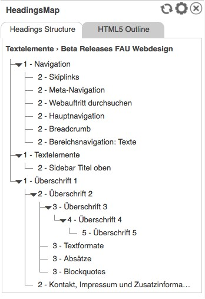
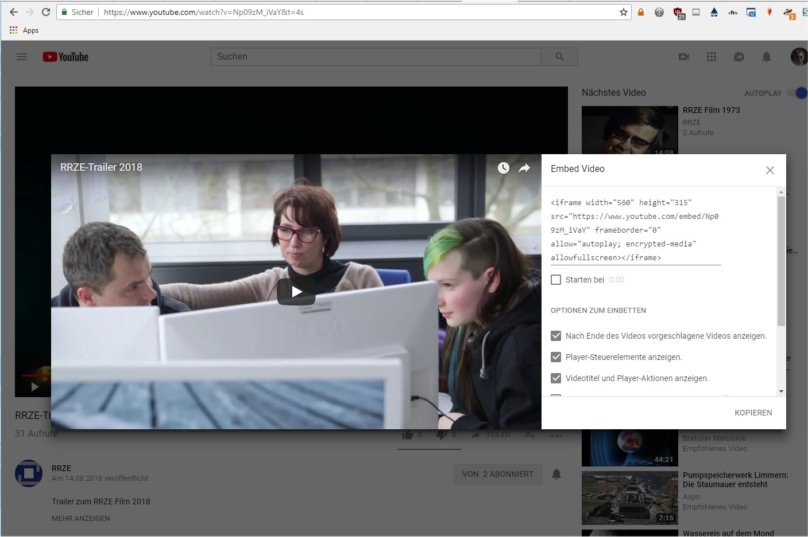
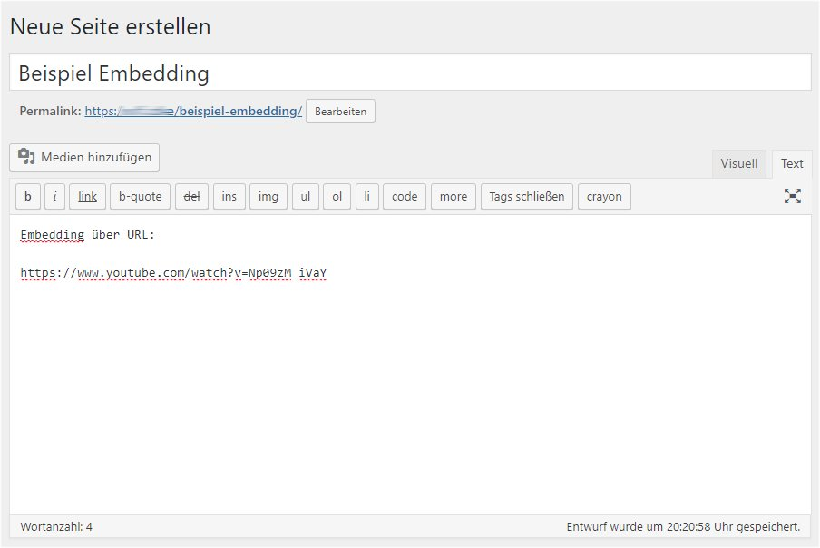

Bereitstellung und Pflege von Inhalten
======================================

Aufgabenbereich und Zielgruppe
------------------------------

Dieser Anwendungsbereich betrifft die Erstellung von Pflege von Inhalten
auf Webauftritten von Hochschulen, deren Einrichtungen, Lehrstühlen,
Projekten und anderen Informationsseiten.

Dieses Kapitel wendet sich an folgende Personenkreise:

-   Redakteure
-   Autoren
-   Fotoredakteure und
-   sonstige Bearbeiter von Inhalten.

Es wird davon ausgegangen, dass Webangebote in diesen Bereichen über ein
geeignetes Content-Management-System verwaltet werden, das über
Eingabeverfahren mit Hilfe von einem WYSIWYG- oder zumindest Text-Editor
verfügt, in dem einfache HTML-Anweisungen eingegeben werden können.

**Abgrenzung: Die Programmierung von CMS oder die optische und
technische Gestaltung der Ausgaben über HTML, CSS und JavaScript ist
nicht Teil dieses Kapitels.**

Grundlagen
----------

Mit Inhalten sind all die Informationen gemeint, die vom Leser
wahrgenommen werden müssen. Zur besseren Darstellung und Strukturierung
der Inhalte wird auf Webseiten die Strukturierungssprache HTML
verwendet. Mit dieser kann auch die inhaltliche Bedeutung eindeutig
definiert werden, wozu auch nur wenige, leicht zu merkendende Elemente
notwendig sind: Nämlich die Elemente für Überschriften, Absätze, Bilder,
Listenelemente, Zitate und Tabellen. In HTML nutzt man den Begriff der
[Semantik](https://blog.kulturbanause.de/2008/01/html-elemente-und-semantik/).

Wichtig hierbei ist jedoch, dass die Semantik eingehalten wird:
Überschriften, die nicht mittels der verfügbaren HTML-Elementen als
solche gekennzeichnet sind, sind keine. Der „klassische Fehler\" vieler
Autoren besteht dann auch darin, dass keine Überschriften gesetzt
wurden, sondern eine Textzeile schlicht mit Fettdruck und einer größeren
Schrift optisch hervorgehoben wurde. Semantisch sind solche
Überschriften eben keine und werden daher auch nicht als solche
interpretiert: Screenreader können diese nicht von normalem Text
unterscheiden und auch die Analyse von Suchmaschinen wird hier den
Inhalt dieser Zeile nicht als hervorhebenswerte Überschrift einstufen.
Der Fettdruck und die Schriftgröße werden lediglich als optische
Darstellung interpretiert; Eine *automatische Erkennung*, dass hier eine
Überschrift gemeint sei, passiert nicht. Diese Interpretation fand
allein im Auge des Autors statt.

Optionale Teile und Formatierungsanweisungen, die nur dazu dienen, die
Anzeige der Inhalte optisch präsentabler zu gestalten, sind keine
Inhalte, die eine notwendig zu übermittelnde Botschaft tragen.

Auf Webseiten, aber auch auf Flyern und anderen Print-Produkten erfolgt
sehr häufig eine optische Verschönerung durch sogenannte
*Schmuckgrafiken*. Da diese Grafiken jedoch keine inhaltliche Aussage
übermitteln, können sie jederzeit auch weggelassen oder ausgetauscht
werden. Mit diesem Verständnis kann man solche Grafiken auch von
Schemagrafiken, Auswertungen oder anderen Grafiken unterscheiden:
Schmuckgrafiken können jederzeit ausgetauscht oder weggelassen werden,
während Grafiken, die einen Inhalt tragen, nicht wegzulassender
Bestandteil der Seite sind.

Ein weiterer häufiger Fehler neben dem, keine Semantik zu verwenden, ist
es, eine Semantik falsch zu verwenden mit dem Ziel eine optische
Darstellung zu erlangen:

So zum Beispiel verwenden einige Autoren gern Überschriften, um einen in
ihren Augen wichtigen Text hervorzuheben. Ebenso häufig ist der Fehler,
eine Überschrift einer bestimmten Ebene nur deswegen zu verwenden, weil
sie dem Autor in der jeweiligen Größe besser gefällt als die
Überschrift in ihrer korrekten Ebene. Oder es werden Tabellen verwendet,
um eine rein optische Ausrichtung des Textes zu erlangen.

Wenn eine optische Hervorhebung von Texten gewünscht ist, dürfen hierzu
keine Strukturelemente, die für die inhaltliche Kennzeichnung vorgesehen
sind, verwendet werden. Wenn ein Absatz oder einzelne Worte optisch
hervorgehoben werden sollen, ist es Sache des Webdesigns, eine
entsprechende Funktionalität bereitzustellen. Viele Webdesigns enthalten
bereits entsprechende Funktionalitäten für optionale Boxen, Spaltensatz,
Hinweismarken oder Buttons. Sollte eine entsprechende Dokumentation oder
ein Styleguide vorhanden sein, sollten diese konsultiert werden.

Umsetzung
---------

### Überschriften und Überschriftshierachien

Inhalte beginnen üblicherweise mit einer Überschrift, gefolgt von einem
oder mehren Absätzen. Beim Schreiben von längeren Texten ist eine
logische Überschriftenhierachie wichtig: Die erste Überschrift im
Dokument ist eine Überschrift der Ebene 1. Ist der Text hierarchisch
gegliedert, folgt ein Absatz mit einer Überschrift der Ebene 2. Besteht
dieses Kapitel aus weiteren hierarchisch untergeordneten Kapitel folgen
hier die Überschriften der Ebene 3 und so weiter.

In HTML wird die Überschrift der ersten Ebene mit `<h1>` deklariert, die
zweite Ebene mit `<h2>`, die dritte mit `<h3>` und so weiter bis zur
sechsten Ebene. Wird in einem CMS ein WYSIWYG-Editor wie beispielsweise
der populäre TinyMCE-Editor angeboten, werden die Überschriften als
Absatzvorlagen angeboten. Diese werden nach der Eingabe in dem Editor in
die entsprechende HTML-Variante gesetzt.


Bei einigen CMS und Redaktionssystemen wurde die Überschrift der ersten
Ebene aus den Absatzvorlagen entfernt, wie es auch das obige Bild
zeigt. Grund hierfür ist, dass viele Webseiten in der Ausgabe den Titel
der Seite als erste Überschrift ausgeben.

Die Überschriften sind nur in ihrer logischen Struktur zu nutzen und
nicht als Hilfsmittel zur optischen Formatierung der Texte. Wie eine
Überschrift einer beliebigen Ebene optisch auf einem Browser, in einem
Officedokument oder einem Ausdruck aussieht, ist Sache des Corporate
Designs oder der zugrundeliegenden Dokumentenvorlage. Wenn die optische
Darstellung nicht passend erscheint, so ist nicht die 
Überschriftenhierachie zu ändern, sondern das Corporate Design bzw. die
Dokumentenvorlage. Als Redakteur oder Autor einer Webseite oder eines
Dokumentes sollte man sich jedoch grundsätzlich nicht um die optische
Gestaltung der Inhalte kümmern und daher auch nicht versuchen, diese zu
beeinflussen.

Die logische Reihenfolge von Überschriftenhierachien ist von hoher
Bedeutung bei der barrierefreien Umsetzung von Webseiten und Dokumenten:
Die Überschriften sind für Screenreader-Software ein unverzichtbares
Mittel, um innerhalb der Seite zu navigieren. Die Software erkennt
Überschriften anhand der korrekten HTML-Markierung und bietet dem
(blinden) Leser der Seite die Möglichkeit an, von Kapitel zu Kapitel zu
springen. Sind die Kapitel jedoch nicht mit Überschriften versehen oder
mit Überschriften der falschen Hierachieebene, funktioniert dies nicht.
Barrierefreie Webseiten setzen die Überschriftenhierachie nicht nur für
den Inhaltsbereich um, sondern gliedern auch alle anderen Bestandteile
der Webseite in einer passenden Hierachie. Mit einem Browser-Addon, wie
beispielsweise
[HeadingsMap](https://chrome.google.com/webstore/detail/headingsmap/flbjommegcjonpdmenkdiocclhjacmbi),
kann man sich die Überschriftenhierachie einer Webseite gesondert
anzeigen lassen.



Neben Screenreadern nutzen auch Suchmaschinen die Überschriften und deren
logische Abfolge zur Einordnung von Inhalten. Wenn Sie also Wert darauf
legen, dass eine Information besser gefunden wird, sollten Sie auf eine
hierachische Gliederung des Inhalts achten.

#### Verpflichtende Erfolgskriterien

-   [1.3.1 Info und Beziehungen](https://www.w3.org/WAI/WCAG21/quickref/#info-and-relationships)
    (Stufe A)
-   [2.4.6 Überschriften und Labels](https://www.w3.org/WAI/WCAG21/quickref/#headings-and-labels)
    (Stufe AA)

#### Optionale Erfolgskriterien

-   [2.4.10 Abschnittsüberschriften](https://www.w3.org/WAI/WCAG21/quickref/#section-headings)
    (Stufe AAA)

### Absätze und andere Textbereiche

Beim Schreiben von Text für Webseiten gelten dieselben Regeln wie auch
bei jeder anderen Publikation oder wissenschaftlichen Arbeit: Der Text
muss für die jeweilige Zielgruppe verständlich sein, klar strukturiert
und frei von Rechtsschreibfehlern. Dabei sollte man jedoch nicht davon
ausgehen, dass der Leser der Webseite denselben Kenntnisstand hat wie der
Autor. Abkürzungen, interne Begriffe und Codewörter, die im Umfeld des
Autors oder in Projekten alltäglich verwendet werden, müssen für andere
nicht bekannt sein. Zudem können dieselben Abkürzungen je nach Umfeld
und Kontext auch verschiedene Bedeutungen haben. Bei einem längeren Text
bietet es sich zudem an, im allerersten Absatz eine kurze
Zusammenfassung oder eine Einführung zu schreiben. Die WCAG selbst
fordert die Verständlichkeit von Texten.

Jan Eric Hellbusch schreibt zur
[Verständlichkeit](https://www.barrierefreies-webdesign.de/knowhow/verstaendliche-inhalte/):
> Textverstehen ist ein aktiver Prozess und eine Interaktion zwischen
Text und Leser. Texte sind für unterschiedliche Leser unterschiedlich
leicht verstehbar. Dies hat sowohl mit den Interessen und dem Vorwissen
des Lesers zu tun, als auch mit dessen individuellen Fähigkeiten.
Aufgrund der unterschiedlichen Voraussetzungen können Texte nicht für
alle Leser gleichermaßen verständlich gemacht werden. Dennoch können
Voraussetzungen geschaffen werden, die zur Textverständlichkeit
beitragen und die Zugänglichkeit der Inhalte auf der
Verständlichkeitsebene fördern. Hierzu zählen redaktionelle Aspekte wie
die Verwendung geläufiger Begriffe oder kurzer Sätze und gestalterische
Maßnahmen wie das Vermeiden von Blocksatz und die Berücksichtigung von
relativen Schriftgrößen und höheren Zeilenabständen. Auch die Verwendung
von Zwischenüberschriften gehört zu den Anforderungen der
Verständlichkeit

#### Sprache

Ein Text wird üblicherweise in nur einer Sprache geschrieben. Auch wenn
die Sprache für einen Leser offensichtlich erscheint, muss die Sprache
der Webseite als Ganzes und optional auch in Teilen von Texten angegeben
werden. Für die Definition der gesamten Seite in einer Sprache ist bei
modernen Webauftritten das jeweilige CMS zuständig. Je nach Einstellung
des Webauftritts wird dabei vorgegeben, welches die Hauptsprache des
Webauftritts und damit auch der Inhalte ist. Als Autor oder Redakteur
kann man diese *globale* Einstellung normalerweise nicht ändern. Unter
Umständen bieten manche CMS Installationen die Option an, die Sprache
einer einzelnen Inhaltseite gesondert anzugeben:


Auch wenn die Angabe der Sprache für einen *sehenden Leser* unnötig
erscheint, ist sie dennoch von großer Bedeutung:

-   Screenreader lesen den Text vor. Damit der Text jedoch in der
    richtigen Sprache und in der korrekten Aussprache vorgelesen werden
    kann, muss die Screenreader-Software auch erkennen können, um welche
    Sprache es sich handelt. Eine automatische Erkennung ist zwar nicht
    unmöglich, sie ist jedoch nicht zuverlässig. Zumal dann, wenn die
    Hauptsprache des Webauftritts ebenfalls angegeben wurde und sich von
    der Sprache des Textabschnitts unterscheidet.
-   Neben Menschen besuchen auch Suchmaschinen und Inhaltsaggregatoren
    die Webseiten. Auch diese versuchen, den Inhalt zu interpretieren und
    verwenden zur Einordnung und Erkennung von Keywords und Synonymen
    die angegebene Sprache. Ist die Sprache nicht oder falsch angegeben,
    kann der Inhalt falsch zugeordnet werden, was in der Praxis bedeuten
    kann, dass die Seite in der Ergebisliste einer Suchmaschine an einer
    schlechten Position aufgelistet wird.

Gibt das CMS oder dessen Bearbeitungswerkzeuge keine Optionen vor, um
die Sprache der Inhaltsbereiche anzugeben, ist diese mittels HTML zu
setzen. Hierzu eignet sich das Attribut *lang=""* welches in dem
HTML-Element angegeben wird, das den Text mit der Sprache umgibt.
Handelt es sich nur um einen Absatz, kann man das `<p>`; Element nutzen,
handelt es sich um ein längeres Zitat, verwendet man das `<blockquote>`
Element.

Beispiel mit zwei Absätzen. Der erste gibt keine Sprachdefinition an.
Der zweite Absatz setzt die Sprache auf Englisch:

```html
    <p>
      Dies ist ein Absatz ohne Sprachdeklaration. Es wird die Sprache verwendet, 
      die vom CMS bzw. dem Webseitentemplate im head-Bereich der Seite 
      angegeben wurde.
   </p>
   <p lang="en">
      This is an Englisch paragraph.
   </p> 
```

Sollte sich der Textbereich über mehrere Kapitel und Absätze erstrecken,
setzt man die Sprachdefinition nicht in jedem einzelnen Absatz neu,
sondern verwendet das Element `<div>` um alle darin liegenden Absätze zu
deklarieren:

```html
   <h1>Text in einer deutschsprachigen Seite mit englischen Absätzen</h1>
   <p>
      Dies ist ein Absatz ohne Sprachdeklaration. Es wird die Sprache verwendet, 
      die vom CMS bzw. dem Webseitentemplate im head-Bereich der Seite 
      angegeben wurde.
   </p>
   <div lang="en">
       <h2>Chapter One</h2>
       <p>
           This is an Englisch paragraph in chapter one.
       </p> 

       <h2>Chapter Two</h2>
       <p>
           This is the first paragraph in chapter two.
       </p> 
       <p>
           This is the second paragraph in chapter two.
       </p>
   </div> 
```

#### Abkürzungen

Bei der Verwendung von Abkürzungen sollte man grundsätzlich folgende
Dinge beachten:

-   Bei der Verwendung von Abkürzungen sollten diese bei dem ersten
    Auftreten im Text ausgeschrieben werden. Dies gilt besonders bei
    längeren Namen von Einrichtungen oder Titeln. Dabei wird zunächst
    der Name ausgeschrieben, gefolgt von der Abkürzung in runden 
    Klammern. Beispiel: *Friedrich-Alexander-Universität Erlangen-Nürnberg (FAU)*.
-   Eine Ausnahme gibt es hingegen bei solchen Abkürzungen, die in der
    kurzen Form bereits Teil der Alltagssprache, in ihrer
    ausgeschriebenen Form hingegen jedoch weitgehend unbekannt sind. So
    zum Beispiel die Abkürzungen "DSL" oder "WLAN". Die ausgeschriebenen
    Formen dieser Abkürzungen ("*<span lang="en">Digital Subscriber Line</span>*"
    und "*<span lang="en">Wireless Local Area Network</span>*") sind oft nicht
    gängig, während die Bedeutung der kurzen Form für jeden Leser klar
    ist.
-   Sollte bei der Ausschreibung der Abkürzung ein Sprachwechsel
    erfolgen, muss diese über geeignete HTML-Anweisungen im Code
    deklariert werden. Hierzu eignet sich das Attribut *lang=""*.

##### Beispiele:

Bei der Ausschreibung von *WLAN* sähe der entsprechende HTML-Code daher
so aus:

```html
   <span lang="en">Digital Subscriber Line</span>
```

Wird die Abkürzung nicht ausgeschrieben, wird das `<abbr>`-Element
verwendet um sie als solche zu deklarieren:

```html
<abbr title="zum Beispiel">z.B.</abbr>
```

Kommt es dabei zudem zu einem Sprachwechsel, wird das Attribut
*lang=""* ergänzt; Als Inhalt des Attributs wird der jeweilige [Code der Sprache](https://www.w3.org/International/questions/qa-html-language-declarations.de)
der Abkürzung verwenden:

```html
<abbr title="World Wide Web" lang="en">WWW<abbr>
```

#### Verpflichtende Erfolgskriterien

-   [3.1.1 Sprache der Seite](https://www.w3.org/WAI/WCAG21/quickref/#language-of-page)
    (Stufe A)
-   [3.1.2 Sprache von Teilen](https://www.w3.org/WAI/WCAG21/quickref/#language-of-parts)
    (Stufe AA)

#### Optionale Erfolgskriterien

-   [3.1.3 Ungewöhnliche Wörter](https://www.w3.org/WAI/WCAG21/quickref/#unusual-words)
    (Stufe AAA)
-   [3.1.4 Abkürzungen](https://www.w3.org/WAI/WCAG21/quickref/#abbreviations)
    (Stufe AAA)
-   [3.1.5 Leseniveau](https://www.w3.org/WAI/WCAG21/quickref/#reading-level)
    (Stufe AAA)
-   [3.1.6 Aussprache](https://www.w3.org/WAI/WCAG21/quickref/#pronunciation)
    (Stufe AAA)

#### Vertiefung

-   Jan Eric Hellbusch:
    [Sprachangabe](https://www.barrierefreies-webdesign.de/knowhow/sprachangabe/)

### Bilder und Schemagrafiken

Mit Hilfe von Bildern und Schemagrafiken können viele Informationen an
den Leser übermittelt werden: Inhaltliche Informationen und Daten, aber
auch Stimmungen. Im letzteren Fall wird oft von sogenannten
*Schmuckgrafiken* oder von *dekorativen Elementen* gesprochen: Die
Bilder tragen in sich keinen eigentlichen Inhalt, sondern dienen schlicht
dazu, die Webseite für einen sehenden Leser oder für den Ausdruck
optisch ansprechend zu gestalten. Würde man diese Bilder weglassen, würde
der Leser keine Information vermissen. Dem gegenüber stehen Bilder und
Schemagrafiken, die tatsächlich Informationen enthalten. Würde man diese
Bilder ausblenden, würden wesentliche Informationen fehlen oder gar die
gesamte Seite inhaltsleer sein.

Für die Barrierefreiheit ist es wichtig, dass Bilder und Schemagrafiken
entweder im Text erklärt werden, so dass man auch ohne diese auskommt,
oder dass die Bilder über eine geeignete Textalternative verfügen. Die
Textalternative muss die gesamte vom Bild übermittelte Information
enthalten.

Die Art der Textalternative ist dabei abhängig von der Art des Bildes:

-   Handelt es sich um eine Schmuckgrafik, so sollte keine
    Textalternative angegeben werden. Screenreader sollen diese Bilder
    ignorieren; Eine Beschreibung ist daher wegzulassen.
-   Handelt es sich um eine Illustration eines im Text beschriebenen
    Sachverhaltes, ist lediglich eine kurze Textbeschreibung notwendig.
-   Wenn es sich bei dem Bild um ein informatives Bild handelt, welches
    nicht im Text beschrieben wird, ist eine ausführliche
    Textalternative für das Bild zu hinterlegen.
-   Handelt es sich bei dem Bild um ein aktives Element um auf eine
    andere Webseite zu verlinken oder als grafischer Button eine Aktion
    auszulösen, ist nicht das Bild inhaltlich zu beschreiben, sondern
    das Linkziel oder das was passiert, wenn man auf das Bild klickt.

Um eine Textalternative eines Bildes anzugeben, verwendet man im
HTML-Element `` die Attribute *alt=""* und *title=""*.
Unterstützt das CMS des Webauftritts auch Bildunterschriften, sind auch
diese anzugeben, sofern das Bild keine Schmuckgrafik ist.

#### Beispiele:

1.  Die Wikipedia-Seite zur [Mona
    Lisa](https://de.wikipedia.org/wiki/Mona_Lisa) beschreibt das
    gleichnamige Bild von Leonardo da Vinci. Wenn man das Bild nun in
    einer Seite einbinden möchte, könnte man folgende HTML-Anweisung
    nutzen:

    ```html
    
    ```

    Hier wird als Textalternative für das Bild der Text *Gemälde der
    Mona Lisa (La Joconde) von Leonardo da Vinci* angegeben, während der
    Titel schlicht *Mona Lisa* ist. Gleichwohl wäre diese Beschreibung
    als Ersatz sehr knapp - auch für sehende Menschen. Es fehlt an
    weiteren Informationen über das Bild. Diese sollte man entweder im
    dem Bild umrandenden Text angeben oder verlinken. Das Attribut
    *alt=""* sollte hingegen nicht für Essays verwendet werden. Der
    Alternativtext im Bild-Element soll zweckmäßig sein und die Länge
    von 80 Zeichen nicht überschreiten. Handelt es sich bei den Bilder
    um ein Foto mit Personen oder Gegenstände, sollte man diese im
    Alternativtext namentlich angeben.

2.  Bei einem dekorativen Bild wird das Attribut *alt=""* leer
    gelassen:

    ```html
    
    ```

3.  Bei einem grafischen Link wird hingegen das Linkziel beschrieben und
    nicht mehr das Bild:

    ```html
    <a href="https://www.fau.de"></a>
    ```

#### Verpflichtende Erfolgskriterien

-   [1.1.1
    Nicht-Text-Inhalt](https://www.w3.org/WAI/WCAG21/quickref/#non-text-content)
    (Stufe A)
-   [2.4.4 Linkzweck (im
    Kontext)](https://www.w3.org/WAI/WCAG21/quickref/#link-purpose-in-context)
    (Stufe A)

#### Vertiefung

-   Jan Eric Hellbusch: [Informative
    Bilder](https://www.barrierefreies-webdesign.de/knowhow/textalternative/informative-bilder.html)
-   Jan Eric Hellbusch: [Entscheidungsschema für Textalternativen von
    Bildern](https://www.barrierefreies-webdesign.de/knowhow/textalternative/entscheidungsschema.html)

### Links

Abseits von den Menüs und Navigationskonzepten einer Website werden auch
Links im Inhaltsbereich von Seiten gesetzt. Auch wenn das eigentliche
Setzen von Links nicht schwierig ist, können einige Fehler gemacht
werden, welche negative Auswirkungen auf Barrierefreiheit, Verständnis
und auch Findbarkeit haben.

Folgende Eigenschaften muss jeder Link erfüllen:

-   Ein Link sollte grundsätzlich immer klar und deutlich machen, was
    den Leser erwartet, wenn er diesen auswählt. Und zwar schon vor dem
    "Klick" und auch vor einem *mouseover*.
-   Ein Link muss auch immer für sich allein genommen verständlich sein.
    So muss er auch dann, wenn er allein und ohne umgebenden Text
    ausgegeben wird, noch immer das Ziel und seinen Zweck klar
    beschreiben.

Verlinkt man auf eine andere Webseite, ist der Linktext optimalerweise
der Titel der Webseite. Verlinkt man auf ein Dokument, so wird der Titel
des Dokumentes verwendet. Keinesfalls sollte man als Linktext jedoch
Handlungsanweisungen verwenden. Ein Klassiker bei fehlerhaften
Umsetzungen ist ein Link wie dieser: "*Klicken Sie **hier***" . Das Wort
"**hier**" für sich allein genommen sagt nichts darüber aus, was
passiert, wenn man tatsächlich auf den Link klickt. Stattdessen sollte
an solchen Stellen besser so formuliert werden: "*Rufen Sie die
**Online-Broschüre zum Thema ABC** auf.*". Der eigentliche Link wäre
dann auf den Worten "**Online-Broschüre zum Thema ABC**". Dies ist ohne
den Text davor auch für sich allein verständlich und der Leser wird
wissen, was ihn beim Klick auf den Link erwartet.

Im normalen Textbereichen wird ein Link mit den HTML-Element `<a>`
gesetzt:

```html
Rufen Sie die <a href="(URL)"><Online-Broschüre zum Thema ABC</a> auf.
```

Bei Nutzung eines WYSIWYG-Editors reicht es oft, den entsprechenden Text
zu selektieren und dann in einem erscheinenden Fenster die Zieladresse
einzugeben oder aus einer Liste vorhandener Seiten auszuwählen.


#### Weitere Attribute

Zu beachten ist, dass im Fall einfacher Links auf Dokumente keine
weiteren Angaben oder Attribute notwendig sind. Auch die Angabe, welche
dafür sorgt, dass ein Link in einem neuen Fenster oder Tab geöffnet wird,
sollte vermieden werden. Man kann nicht davon ausgehen, dass das Öffnen
eines neuen Fensters für Links von jedem Leser erwünscht ist.
Tatsächlich sorgt das Öffnen eines neuen Fensters auch zu einigen
Nachteilen bei den Lesern der Seite: Die *"Zurück"-Funktion* des Browser
funktioniert für das neue Fenster nicht mehr und der Rechner wird
möglicherweise durch viele neue Fenster stärker belastet. Wurde die
Seite zudem mit einem Smartphone aufgerufen, wird das neue Fenster
üblicherweise das vorherige komplett überlagern. Ob ein neues Fenster
oder ein Tab geöffnet wird, sollte daher grundsätzlich dem Leser selbst
überlassen bleiben, der hierfür die dafür gedachten Werkzeuge seines
Browsers nutzen kann.

Auf manchen Webseiten sieht man, dass Links zusätzlich mit einem
*title=""*-Attribut versehen wurden.
Dies sollte man ebenfalls nur in besonderen Ausnahmefällen tun. Das
Attribut sollte nur dann verwendet werden, wenn der Linktext nicht
gleich dem tatsächlichen Titel des aufzurufenden Dokumentes ist.
Screenreader werden bei einem Link üblicherweise sowohl den Title,
sofern vorhanden, als auch den Linktext vorlesen. Sind Linktext und
Titel dagegen gleich, werden Menschen mit Screenreader daher denselben
Text unnötigerweise zweimal anhören müssen.

#### Verpflichtende Erfolgskriterien

-   [2.4.4 Linkzweck (im Kontext)](https://www.w3.org/WAI/WCAG21/quickref/#link-purpose-in-context)
    (Stufe A)

#### Optionale Erfolgskriterien

-   [2.4.9 Linkzweck (reiner Link)](https://www.w3.org/WAI/WCAG21/quickref/?showtechniques=249#link-purpose-link-only)
    (Stufe AAA)

### Tabellen

Für die Nutzung von Tabellen gilt eine feste Regel: **Tabellen dürfen
nur für tabellarische Daten genutzt werden.** Tabellen sind nicht dazu
gedacht, Texte und Bilder auszurichten oder die Seite zu layouten. Es
gilt auch hier das oben Genannte: Wenn eine besondere optische
Darstellung benötigt wird, so ist es Aufgabe des Designs und der Technik,
entsprechende Funktionalitäten bereitzustellen. Wird beispielsweise eine
Ausrichtung des Inhaltes in zwei oder mehr Spalten gewünscht, wird dies
bei modernen Websites oft durch eigene Anweisungen geleistet. So
verfügen beispielsweise Websites, die auf dem populären
Bootstrap-Framework beruhen, eine umfangreiche Klassenbibliothek um
Inhaltsbereiche in bis zu 12 Spalten aufzutrennen. Eine Tabelle erweist
sich bei der Nutzung als Gestaltungswerkzeug spätestens bei dem Aufruf
der Seite mit dem Smartphone als untauglich: So werden dann Inhalte
nicht mehr erkennbar und es kommt zu horizonatlen Scrollbalken. Wird
hingegen ein vorgegebenes Grid-System verwendet, werden die Spalten
serialisiert und in korrekter Reihenfolge übereinander positioniert.

Bei der Nutzung von Datentabellen ist den jeweiligen Zellen eine
Überschrift zuzuordnen. Dies erfolgt mit Hilfe des Elements `<th>`. Die
eigentlichen Zellen mit Daten werden dagegen mit dem Element `<td>`
gekennzeichnet. Die Zeilen werden durch das Element `<tr>` 
ausgezeichnet.

Eine einfache Datentabelle ist in HTML wie folgt aufgebaut:

```html
<table>
  <caption> Tabellenüberschrift </caption>
  <tr>
    <th> Überschrift Spalte 1  </th>
    <th> Überschrift Spalte 2  </th>
  </tr>
  <tr>
    <td> Datenzelle </td>
    <td> Datenzelle </td>
  </tr>
</table>
```

Je nach Komplexität der Datentabelle ist es sinnvoll, weitere
Überschriften und Beziehungen von Zellen zueinander zu definieren. Die
[Anleitung des W3C zu Tabellen](https://www.w3.org/WAI/tutorials/tables/) bietet eine
ausführliche Erläuterung mit Beispielen zum korrekten Gebrauch und
Einsatz.

Gängige WYSWIYG-Editoren, wie beispielsweise der TinyMCE-Edtor, verfügen
über Hilfsmittel um Tabellen auch ohne Kenntnisse von HTML zu erstellen.


Hier erfolgt die Bedienung ähnlich zu der in Microsoft Office.

#### Verpflichtende Erfolgskriterien

-   [1.3.1 Info und  Beziehungen](https://www.w3.org/WAI/WCAG21/quickref/#info-and-relationships)
    (Stufe A)

#### Vertiefung

-   W3C/WAI: [Tutorial zu Tabellen](https://www.w3.org/WAI/tutorials/tables/)
-   Jan Eric Hellbusch: [Barrierefreie Tabellen](https://www.barrierefreies-webdesign.de/knowhow/datentabellen/)

### Listen

Nummerierte Aufzählungen und Listen werden auf Webseiten mit eigenen
HTML-Elementen deklariert. Wie auch bei Überschriften und Absätzen ist
bei Listen die Einhaltung dieser Semantik wichtig, damit Aufzählungselemente und Listenpunkte als solcher für Screenreader identifizierbar sind.

Im Redaktionsalltag sind im wesentlichen zwei Formen von Listen in
Gebrauch: Unsortierte und nummerierte Listen. (Es gibt noch eine dritte
From durch die [Definitionslisten](https://wiki.selfhtml.org/wiki/HTML/Textstrukturierung/dl);
Diese werden jedoch nur selten verwendet und sie lassen sich durch eine
normale Überschrift mit einem darauf folgenden Absatz ersetzen).

Eine einfache unsortierte Liste wird in HTML wie folgt aufgebaut:

```html
<ul>
  <li> Unnummeriertes Listenelement </li>
  <li> Unnummeriertes Listenelement </li>
</ul>
```

Die sortierte Liste unterscheidet sich hiervon nur durch die Verwendung
des Elements `<ol>` anstelle von `<ul>`:

```html
<ol>
  <li> Nummeriertes Listenelement 1 </li>
  <li> Nummeriertes Listenelement 2 </li>
</ol>
```

In den Listenelementen können eigene Überschriften, Absätze, weitere
Listen oder andere Elemente gesetzt werden. So kann eine Liste auch eine
untergeordnete Liste enthalten.

Gängige WYSIWYG-Editoren wie der TinyMCE unterstützen auch Listen durch
eigene Bedienelemente:


Zu beachten ist auch hier, wie oben bereits bei den Überschriften und den Tabellen erwähnt: Listen dienen nicht der optischen Gestaltung beliebiger Texte oder zur Einrückung derselben. Sie haben den Zweck, eine
Liste auszuzeichnen. Und umgekehrt bedeutet dies: Wer eine Liste auf einer Seite angeben möchte, der muss dazu auch die Listenelemente verwenden &mdash; und nicht etwa Absätze aus einzelnen Zeilen, die mit einer Zahl beginnen und einem erzwungen Umbruch enden.

Eine korrekt ausgezeichnete Liste wird im Gegensatz zu Absatzzeilen auch
von Screenreader und Analysesoftware als zusammenhängende Liste erkannt.
Zusätzlich wird eine Liste auch bei der Darstellung auf mobilen
Endgeräten mit kleinem Display korrekt umbrochen.

Die Optik der unnummerierten Listen und das Zahlenformat der
nummerierten Listen wird durch das zugrundeliegende Design bestimmt.
Zwar lassen sich in HTML die Zahlenformate über das *list-style-type-
Attribut* vorgeben, dies sollte man jedoch nur in Ausnahmefällen nutzen,
da üblicherweise das Webdesign die Nutzung ohne weitere Attribute als
Standard betrachtet.

#### Verpflichtende Erfolgskriterien

-   [1.3.1 Info und
    Beziehungen](https://www.w3.org/WAI/WCAG21/quickref/#info-and-relationships)
    (Stufe A)

#### Vertiefung

-   Webkrauts: Artikel [Die etwas besseren
    Listen](http://webkrauts.de/artikel/2008/die-etwas-besseren-listen-teil-1)
-   SELFHTML:
    [Listen](https://wiki.selfhtml.org/wiki/HTML/Textstrukturierung/Listen)

### Zitate

Um längere Zitate darzustellen, verwendet man das
`<blockquote>`-Element. Die optische Form dieser Darstellung wird wie
gewohnt von dem zugrundeliegenden Webdesign bestimmt. Üblicherweise wird
ein Zitat jedoch optisch hervorgehoben, indem es links und rechts
eingerückt wird und Schriftart und -stil verändert wird.

```html
<blockquote>
  <p>
   Der Universität ist vorbehalten, was nur der Mensch durch und durch in sich finden kann, die Einsicht in die reine Wissenschaft.
  </p>
</blockquote>
```

Das `<blockquote>`-Element umrandet darin befindliche Absätze.

Soll zusätzlich ein Zitatgeber oder eine Quelle genannt werden, kann
dies mit Hilfe des `<cite>` Elements vorgenommen werden. Dies darf dann
jedoch nicht im eigentlichen Zitat-Absatz stehen, sondern muss hiervon
getrennt sein (beispielsweie mit einem `<footer>`-Element).

```html
<blockquote>
  <p>
      Der Universität ist vorbehalten, was nur der Mensch durch und durch in sich finden kann, die Einsicht in die reine Wissenschaft.
  </p>
  <footer>
     <cite>Wilhelm von Humboldt (1767 - 1835)</cite>
  </footer>
</blockquote>
```

Liegt dem gesamten Zitat eine externe Quelle zugrunde, kann diese mit
einem Attribut im `<blockquote>`-Element ergänzt werden, nämlich mit
*cite="(URL)"*. (Bedauerlicherweise hat das Attribut denselben Namen wie
das Element; Es handelt sich aber dennoch um unterschiedliche Dinge).

```html
<blockquote cite="https://de.wikiquote.org/wiki/Albert_Einstein">
  <p>
      Ich habe keine besondere Begabung, sondern bin nur leidenschaftlich neugierig.
  </p>
  <footer>
     <cite>Albert Einstein</cite>
  </footer>
</blockquote>
```

Falls die Zitate kürzer ausfallen und keinen langen Text beinhalten,
kann man auch das `<cite>`-Element innerhalb eines Absatzes nutzen:

```html
<p>
    <cite>
    Woran erkennt man barrrierefreies Internet? - Gar nicht! Das ist ja gerade das Gute!
    </cite>
</p>
```

#### Verpflichtende Erfolgskriterien

-   [1.3.1 Info und Beziehungen](https://www.w3.org/WAI/WCAG21/quickref/?showtechniques=249#info-and-relationships)
    (Stufe A)
-   [3.2.4 Konsistente Erlennung](https://www.w3.org/WAI/WCAG21/quickref/?showtechniques=324#consistent-identification)
    (Stufe AA)

#### Vertiefung

-   mediaevent.de: [HTML blockquote -
    Zitat](https://www.mediaevent.de/xhtml/blockquote.html)
-   developer.mozilla.org: [The Citation
    element](https://developer.mozilla.org/en-US/docs/Web/HTML/Element/cite)

### Embeddings

Immer mehr moderne Webseiten ergänzen textuelle Informationen mit
multimedialen Inhalten, die von darauf spezialisierten Portalen kommen.
Dies können zum Beispiel Bildergalerien, Videos, Tonmitschnitte, Karten,
Vortragsfolien aber auch Interaktive Bedienoberflächen sein.
Beispielsweise werden viele Online-Kurse und Tutorials in Form kurzer
Videos auf der Plattform [YouTube](https://www.youtube.com) abgelegt und
Vortragsfolien finden sich oft auf dem Portal
[SlideShare](https://www.slideshare.net). Auf sehr vielen Webauftritten
finden sich unter der Beschreibung des Kontakts auch eingebundene Karten
von [OpenStreetMap](https://www.openstreetmap.de/) oder Google Maps.

Von einem *Embedding* wird gesprochen, wenn ein Inhalt von einem dieser
Portale in die eigene Webseite integriert wird. So wird beispielsweise
ein Video von YouTube im Inhaltsbereich der Seite gezeigt.

Auch wenn viele CMS inzwischen die Bereitstellung und Wiedergabe
entsprechender Dateien beherrschen, sind die Portale aufgrund ihrer
Spezialisierung in der spezifischen Bereitstellung des Contents jedem
CMS technisch und funktionell überlegen. Es ist daher nicht
verwunderlich, wenn auch große Websites für die Bereitstellung von
Videos oder Karten auf die entsprechenden Portale oder eigenständige
Softwarelösungen außerhalb des CMS ausweichen.

Die meisten Inhaltsportale und auch die meisten CMS unterstützen das
Embedding mit Hilfe entsprechender Funktionalitäten, mit deren Hilfe
externer Content einfach in die eigene Webseite "embedded" werden kann.

So bietet YouTube beispielsweise unter dem Link *Teilen* die Funktion
zum Einbetten an. Dieses öffnet ein neues Fenster in dem man einen
HTML-Code angeboten bekommt, welchen man in seine eigene Webseite
integrieren kann:



Moderne CMS nutzen zudem vermehrt die
[oEmbed-Schnittstelle](https://oembed.com/) . Mit dieser ist es für den
Autor einer Seite nicht mehr nötig, irgendeinen HTML-Code auf der
Portalseite zu suchen und ihn dann einzubinden.

Stattdessen reicht es, die URL des Videos oder der Information auf dem
Portal aus der Adresszeile des Browsers zu nehmen und in den Editor zu
kopieren.



Dies passiert im CMS WordPress sogar schon im WYSIWYG-Editor:


Im Sinne der Barrierefreiheit ist das Embedding nicht unumstritten: Die
Betreiber einer Seite und erst recht nicht die Redakteure haben Einfluss
auf die Barrierefreiheit des Embeddings. Es bleibt in vielen Fällen nur
die Wahl: Wenn man die Information einer fremden und nicht
barrierefreien Quelle einbindet, hilft man einer großen Zahl an
Personen. Läßt man die Einbindung hingegen weg, da sie nicht vollständig
barrierefrei ist, hat niemand einen Vorteil.

Große Portale kennen diese Problematik auch und versuchen bereits von
sich aus, den Content eines Embeddings barrierefrei zu
liefern. So werden die Embeddings inzwischen mit Techniken ausgeliefert,
die eine Zugänglichkeit für assistive Medien unterstützen. Videos werden
beispielsweise automatisch mit Audiotranskriptionen versehen und von
Vortragsfolien wird eine Textfassung bereitgestellt. Dies geschieht bei
den betreffenden Portalen weitgehend automatisch, ist jedoch auch
abhängig von der Sorgfalt der Personen, welche die Informationen
hochgeladen haben und dort die Möglichkeit hatten, entsprechende notwendige
Informationen zu ergänzen.

#### Empfehlungen für den Einsatz von Embeddings

Der Autor einer Seite kann sich bei einem Embedding nicht sicher sein,
ob dieses tatsächlich barrierefrei geliefert wird oder nicht. Daher
sollte hier eine Lösung ähnlich wie der bei dem Einsatz von Bildern
vorgenommen werden:

- Sofern das Embedding **zwingend notwendige Informationen** enthält, die der Leser der Webseite erfahren muss, sollten diese Informationen **zusätzlich in Textform** bereitgestellt werden.

Um den Konformitätsanforderungen der WCAG Genüge zu tun, ist deutlich zu
machen, dass der angezeigte Content von einer Drittquelle kommt. Daher:

- **An geeigneter Stelle vor oder nach dem Embedding wird auf die Quelle hingewiesen.** Hierbei sollte bestenfalls das Quellportal (z.B. der YouTube-Kanal ) und der Titel sichtbar sein. Eine gesonderte Verlinkung sollte ebenfalls vorgenommen werden, so dass man hierfür nicht auf das Embedding selbst angewiesen ist.

#### Verpflichtende Erfolgskriterien

Autoren von Webseiten, die aufgrund von Inhalten, die außerhalb der Kontrolle des Autors liegen, nicht konform sein können, müssen eine [Erklärung partieller Konformität](https://www.w3.org/Translations/WCAG20-de/#conformance-partial) vornehmen. Bei einer Prüfung der Seite gemäß den Richtlinien der WCAG
würde dies bedeuten, dass man die Seite nur ohne das Embedding prüft und
die eingebundenen Teile als solche deutlich erkennbar macht. Das kann
zum Beispiel dadurch geschehen, dass man den Inhalt, wie oben empfohlen,
als zusätzlichen Text beschreibt.

Wichtig ist hierbei, dass der Leser der Seite deutlich erkennen kann, dass der Inhalt aus einer Drittquelle kommt.

#### Rechtlicher Hinweis (Stand August 2018)

Die EU-Richtlinie schränkt in Artikel 1, Absatz 4d) und 4e) die Umsetzung der WCAG ein. Dieser Teil der Richtlinie -nämlich die Einschränkungen und Ausnahmen im Anwendungsbereich- wurde jedoch bei der Umsetzung der Gesetzgebung von einigen Bundesländern (noch) nicht übernommen. Es gilt daher das, was in der WCAG zur Umsetzung der Konformität beschrieben wurde.

#### Vertiefung

-   [oEmbed](https://oembed.com/),
-   W3C: [Erklärung partieller Konformität - Inhalte von
    Dritten](https://www.w3.org/Translations/WCAG20-de/#conformance-partial)

