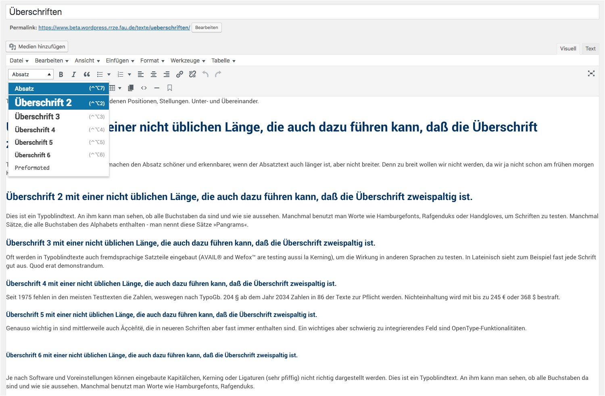

Bereitstellung und Pflege von Inhalten
======================================

Aufgabenbereich und Zielgruppe
------------------------------

Dieser Anwendungsbereich betrifft die Erstellung von Pflege von Inhalten
auf Webauftritten von Hochschulen, deren Einrichtungen, Lehrstühlen,
Projekten und anderen Informationsseiten.

Dieses Kapitel wendet sich an folgende Personenkreise:

-   Redakteure
-   Autoren,
-   Fotoredakteure und
-   sonstigen Bearbeitern von Inhalten.

Es wird davon ausgegangen, dass Webangebote in diesen Bereichen über ein
geeignetes Content-Management-System verwaltet werden, die über
Eingabeverfahren mit Hilfe von WYSIWYG- oder zumindest Text- Editoren
verfügen, in denen einfache HTML-Anweisungen eingegeben werden können.

Abgrenzung: Die Programmierung von CMS oder die optische und technische
Gestaltung der Ausgaben über HTML, CSS und JavaScript ist nicht Teil
dieses Kapitels.

Grundlagen
----------

Mit Inhalten sind all die Informationen gemeint, die vom Leser wahrgenommen werden müssen. Zur besseren Darstellung und Strukturierung der Inhalte wird auf Webseiten die Strukturierungssprache HTML verwendet. Mit dieser kann auch die inhaltliche Semantik eindeutig definiert werden, wozu auch nur wenige, leicht zu merkendende Elemente notwendig sind: Nämlich die Elemente für Überschriften, Absätze, Listenelemente, Zitate, Tabellen, Bilder.

Wichtig hierbei ist jedoch, dass diese Semantik eingehalten wird:
Überschriften, die nicht mittels der verfügbaren HTML-Elemente als solche gekennzeichnet sind, sind keine.
Der „klassische Fehler" vieler Autoren besteht dann auch darin, dass keine Überschriften gesetzt wurden, sondern eine Textzeile schlicht mit Fettdruck und einer größeren Schrift optisch hervorgehoben wurde. 
Semantisch sind solche Überschriften eben keine und werden daher auch nicht als solche interpretiert: Screenreader können diese nicht von normalen Text unterscheiden und auch die Analyse von Suchmaschinen wird
hier den Inhalt dieser Zeile nicht als hervorhebenswerte Überschrift einstufen. Der Fettdruck und die Schriftgröße werden lediglich als optische Darstellung interpretiert; Eine „automatische Erkennung", dass
hier eine Überschrift gemeint sei, passiert nicht. Diese Interpretation fand allein im Auge des Autors statt.

Optionale Teile und Formatierungsanweisungen, die nur dazu dienen, die Anzeige der Inhalte optisch präsentabler zu gestalten, sind keine Inhalte, die eine notwendig zu übermittelnde Botschaft tragen.

Auf Webseiten, aber auch auf Flyern und anderen Print-Produkten erfolgt sehr häufig eine optische Verschönerung durch sogenannte „Schmuckgrafiken". Da diese Grafiken jedoch keine inhaltliche Aussage übermitteln, können sie jederzeit auch weggelassen oder ausgetauscht werden. Mit diesem Verständnis kann man solche Grafiken auch von
Schemagrafiken, Auswertungen oder anderen Grafiken unterscheiden: 
Schmuckgrafiken können jederzeit ausgetauscht oder weggelassen werden, während Grafiken, die einen Inhalt tragen, nicht wegzulassender Bestandteil der Seite sind.

Ein weiterer häufiger Fehler neben der, keine Semantik zu verwenden ist es, eine Semantik falsch zu verwenden mit dem Ziel eine optische Darstellung zu erlangen:

So zum Beispiel verwenden einige Autoren gern Überschriften um einen in ihren Augen wichtigen Text hervorzuheben. Ebenso häufig ist der Fehler, eine Überschrift einer bestimmten Ebene nur deswegen zu verwenden, weil sie dem Autoren in der jeweiligen Größe besser gefällt als die Überschrift in ihrer korrekten Ebene. Oder es werden Tabellen verwendet, um eine rein optische Ausrichtung des Textes zu erlangen.

Wenn Sie eine optische Hervorhebung von Texten wünschen, nutzen Sie bitte keine der Strukturelemente, die für die inhaltliche Kennzeichnung da sind. Möchten Sie, dass ein Text so aussieht, wie eine gewisse Überschrift, dann nutzen Sie nicht einfach so diese Überschrift, sondern fragen Sie den Webdesigner, ob Sie hierzu eine entsprechende HTML-Anweisung erhalten können.  Wenn Sie Text (bei der Darstellung auf Desktop) in Spalten aufteilen wollen, dann fragen Sie ebenfalls oder prüfen den Styleguide ihrer Webseite, ob es hierfür nicht bereits eine eigene Lösung gibt. Aber nutzen dafür keine Tabelle.

Umsetzung
---------

### Überschriften und Überschriftshierachien

Inhalte beginnen üblicherweise mit einer Überschrift gefolgt von einem oder mehren Absätzen.
Bei dem Schreiben von längeren Texten ist eine logische Überschriftenhierachie wichtig: Die erste Überschrift im Dokument ist eine Überschrift der Ebene 1. 
Ist der Text hierarchisch gegliedert, folgt ein Absatz mit einer Überschrift der Ebene 2. Besteht dieses Kapitel aus weiteren hierarchisch untergeordneten Kapitel folgen hier die Überschriften der Ebene 3 und so weiter.

In HTML wird die Überschrift der Ebene 1 mit \<h1> deklariert, die zweite Eben mit \<h2>, die dritte mit \<h3> und so weiter bis zur sechsten Ebene. Wird in einem CMS ein WYSIWYG-Editor wie beispielsweise der populäre TinyMCE-Editor angeboten, werden die Überschriften als Absatzvorlagen angeboten. Diese werden nach der Eingabe in dem Editor in die entsprechende HTML-Variante gesetzt.

 
Bei einigen CMS und Redaktionssystemen wurde die Überschrift der ersten Ebene aus den Absatzvorlagen entfernt. So wie es auch das obige Bild zeigt. Grund hierfür ist, daß viele Webseiten in der Ausgabe den Titel der Seite als erste Überschrift ausgeben.

Die Überschriften sind nur in ihrer logischen Struktur zu nutzen und nicht als Hilfsmittel zur optischen Formatierung der Texte. Wie eine Überschrift einer beliebigen Ebene optisch auf einem Browser, in einem Officedokument oder einem Ausdruck aussieht, ist Sache des Corporate Designs oder der zu grunde liegende Dokumentenvorlage. Wenn die optische Darstellung nicht passend erscheint, so ist nicht die Überschriftenhierachie zu ändern, sondern das Corporate Design. 
Als Redakteur oder Autor einer Webseite oder eines Dokumentes sollte man sich grundsätzlich nicht um die optische Gestaltung der Inhalte kümmern und daher auch nicht versuchen, diese zu beeinflussen. Dies ist Sache des Corporate Designs.

Die logische Reihenfolge von Überschriftenhierachien ist von hoher Bedeutung bei der barrierefreien Umsetzung von Webseiten und Dokumenten: Die Überschriften sind für Screenreader-Software ein unverzichtbares Mittel um innerhalb der Seite zu navigieren. Die Software erkennt Überschriften anhand der korrekten HTML-Markierung und bietet den (blinden) Leser der Seite die Möglichkeit an, von Kapitel zu Kapitel zu springen. 
Sind die Kapitel jedoch nicht mit Überschriften versehen oder mit Überschriften der falschen Hierachieebene funktioniert dies nicht. 
Barrierefreie Webseiten setzen die Überschriftenhierachie nicht nur für den Inhaltsbereich um, sondern gliedern auch alle anderen Bestandteile der Webseite in einer passenden Hierachie. Mit einem Browseraddon, wie beispielsweise [HeadingsMap](https://chrome.google.com/webstore/detail/headingsmap/flbjommegcjonpdmenkdiocclhjacmbi), kann man sich die Überschriftenhierachie einer Webseite gesondert anzeigen lassen.

Neben Screenreader nutzen auch Suchmaschinen die Überschriften und deren logische Abfolge zur Einordnung von Inhalten. Legen Sie daher darauf Wert, daß eine Information besser gefunden wird, sollten Sie auf eine hierachische Gliederung des Inhalts achten.

### Zu erfüllende Erfolgskriterien 
* [1.3.1 Info und Beziehungen](https://www.w3.org/WAI/WCAG21/quickref/#info-and-relationships) (Stufe A)
* [2.4.6 Überschriften und Labels](https://www.w3.org/WAI/WCAG21/quickref/#headings-and-labels) (Stufe AA)

### Optionale Erfolgskriterien
* [2.4.10 Abschnittsüberschriften](https://www.w3.org/WAI/WCAG21/quickref/#section-headings) (Stufe AAA)

#### Merken!
* Verwenden Sie Überschriften zur Gliederung längerer Texte entsprechend ihrer logischen Abfolge
* Überschriften werden aus den HTML-Tags \<h1, \<h2>, \<h3>, \<h4>, \<h5> und \<h6> gebildet. 
* In fett markierte Zeile sind keine Überschriften!
* Verwenden Sie überschriften nicht um die Optik des Textes nach ihren Wünschen anzupassen.

#### Textbereiche

> [2.4.10
> erfüllen](http://www.w3.org/WAI/WCAG20/quickref/#qr-navigation-mechanisms-headings)\|[2.4.10
> verstehen](http://www.w3.org/TR/UNDERSTANDING-WCAG20/navigation-mechanisms-headings.html)

Kompletter Teil 3.1:
<http://www.w3.org/TR/UNDERSTANDING-WCAG20/meaning.html>

> **3.1.1 Sprache der Seite:** Die voreingestellte [menschliche
> Sprache](https://www.w3.org/Translations/WCAG20-de/#human-langdef) jeder [Webseite](https://www.w3.org/Translations/WCAG20-de/#webpagedef) kann [durch Software bestimmt](https://www.w3.org/Translations/WCAG20-de/#programmaticallydetermineddef) werden.
> (Stufe A)
>
> [3.1.1
> erfüllen](http://www.w3.org/WAI/WCAG20/quickref/#qr-meaning-doc-lang-id)\|[3.1.1
> verstehen](http://www.w3.org/TR/UNDERSTANDING-WCAG20/meaning-doc-lang-id.html)
>
> **3.1.2 Sprache von Teilen:** Die [menschliche
> Sprache](https://www.w3.org/Translations/WCAG20-de/#human-langdef) jedes
> Abschnitts oder jedes Satzes im Inhalt
> kann [durch Software bestimmt](https://www.w3.org/Translations/WCAG20-de/#programmaticallydetermineddef) werden
> außer bei Eigennamen, technischen Fachbegriffen, Wörtern einer
> unklaren Sprache und Wörtern oder Wendungen, die Teil des Jargons des
> direkt umliegenden Textes geworden sind. (Stufe AA)
>
> [3.1.2
> erfüllen](http://www.w3.org/WAI/WCAG20/quickref/#qr-meaning-other-lang-id)\|[3.1.2
> verstehen](http://www.w3.org/TR/UNDERSTANDING-WCAG20/meaning-other-lang-id.html)
>
> **3.1.3 Ungewöhnliche Wörter:** Es gibt
> einen [Mechanismus](https://www.w3.org/Translations/WCAG20-de/#mechanismdef),
> um spezielle Definitionen von Wörtern oder Wendungen zu erkennen, [die
> auf ungewöhnliche oder eingeschränkte Weise benutzt
> werden](https://www.w3.org/Translations/WCAG20-de/#unusual-restricteddef), [Idiome](https://www.w3.org/Translations/WCAG20-de/#idiomsdef) und [Jargon](https://www.w3.org/Translations/WCAG20-de/#jargondef) eingeschlossen.
> (Stufe AAA)
>
> [3.1.3
> erfüllen](http://www.w3.org/WAI/WCAG20/quickref/#qr-meaning-idioms)\|[3.1.3
> verstehen](http://www.w3.org/TR/UNDERSTANDING-WCAG20/meaning-idioms.html)
>
> **3.1.4 Abkürzungen:** Es gibt
> einen [Mechanismus](https://www.w3.org/Translations/WCAG20-de/#mechanismdef),
> um die ausgeschriebene Form oder Bedeutung
> von [Abkürzungen](https://www.w3.org/Translations/WCAG20-de/#abbreviationsdef) zu
> erkennen. (Stufe AAA)
>
> [3.1.4
> erfüllen](http://www.w3.org/WAI/WCAG20/quickref/#qr-meaning-located)\|[3.1.4
> verstehen](http://www.w3.org/TR/UNDERSTANDING-WCAG20/meaning-located.html)
>
> **3.1.5 Leseniveau:** Wenn der Text nach der Entfernung von Eigennamen
> und Titeln Lesefähigkeiten voraussetzt, die über das Niveau
> der [niedrigen, sekundären
> Schulbildung](https://www.w3.org/Translations/WCAG20-de/#lowseceddef) hinausgehen,
> dann gibt es [ergänzenden
> Inhalt](https://www.w3.org/Translations/WCAG20-de/#suppcontentdef) oder
> eine Version, die keine über die niedrige, sekundäre Schulbildung
> hinausgehenden Lesefähigkeiten verlangt. (Stufe AAA)
>
> [3.1.5
> erfüllen](http://www.w3.org/WAI/WCAG20/quickref/#qr-meaning-supplements)\|[3.1.5
> verstehen](http://www.w3.org/TR/UNDERSTANDING-WCAG20/meaning-supplements.html)
>
> **3.1.6 Aussprache:** Es gibt
> einen [Mechanismus](https://www.w3.org/Translations/WCAG20-de/#mechanismdef),
> um die bestimmte Aussprache von Wörtern zu erkennen, wenn die
> Bedeutung der Wörter - im Zusammenhang - mehrdeutig ist, wenn man die
> Aussprache nicht kennt. (Stufe AAA)
>
> [3.1.6
> erfüllen](http://www.w3.org/WAI/WCAG20/quickref/#qr-meaning-pronunciation)\|[3.1.6
> verstehen](http://www.w3.org/TR/UNDERSTANDING-WCAG20/meaning-pronunciation.html)

#### Bilder und Schemagrafiken

> **1.1.1
> Nicht-Text-Inhalt:** Alle [Nicht-Text-Inhalte](https://www.w3.org/Translations/WCAG20-de/#non-text-contentdef),
> die dem Benutzer präsentiert werden, haben
> eine [Textalternative](https://www.w3.org/Translations/WCAG20-de/#text-altdef),
> die einem äquivalenten Zweck dient, mit Ausnahme der unten
> aufgelisteten Situationen. (Stufe A)

-   **Steuerelemente, Eingabe: **Wenn es sich bei dem Nicht-Text-Inhalt
    um ein Steuerelement handelt oder Eingaben durch den Benutzer
    akzeptiert, dann hat dieser
    einen [Namen](https://www.w3.org/Translations/WCAG20-de/#namedef),
    der seinen Zweck beschreibt. (Beachten Sie [Richtlinie
    4.1.2](https://www.w3.org/Translations/WCAG20-de/#ensure-compat-rsv) für
    zusätzliche Anforderungen an Steuerelemente und Inhalte, die
    Eingaben durch den Benutzer akzeptieren.)

-   **Zeitbasierte Medien: **Wenn es sich bei den Nicht-Text-Inhalten um
    zeitbasierte Medien handelt, dann stellen Textalternativen zumindest
    eine deskriptive Identifizierung des Nicht-Text-Inhalts bereit.
    (Beachten Sie [Richtlinie
    1.2](https://www.w3.org/Translations/WCAG20-de/#media-equiv) für
    zusätzliche Anforderungen an Medien.)

-   **Test: **Wenn es sich bei dem Nicht-Text-Inhalt um einen Test oder
    eine Übung handelt, die nichtig wäre, wenn sie
    als [Text](https://www.w3.org/Translations/WCAG20-de/#textdef) dargestellt
    würde, dann stellen Textalternativen zumindest eine deskriptive
    Identifizierung des Nicht-Text-Inhalts bereit.

-   **Sensorisch: **Wenn Nicht-Text-Inhalt hauptsächlich dafür gedacht
    ist, eine [bestimmte
    Sinneserfahrung](https://www.w3.org/Translations/WCAG20-de/#sensoryexpdef) zu
    schaffen, dann stellen Textalternativen zumindest eine deskriptive
    Identifizierung des Nicht-Text-Inhalts bereit.

-   **[CAPTCHA](https://www.w3.org/Translations/WCAG20-de/#CAPTCHAdef):** Wenn
    der Zweck des Nicht-Text-Inhalts der ist zu bestätigen, dass eine
    Person und nicht ein Computer auf den Inhalt zugreift, dann werden
    Textalternativen bereitgestellt, die den Zweck des
    Nicht-Text-Inhalts identifizieren. Außerdem werden alternative
    Formen von CAPTCHAs bereitgestellt, die Ausgabeformen für
    verschiedene Arten der sensorischen Wahrnehmung nutzen, um
    verschiedenen Behinderungen Rechnung zu tragen.

-   **Dekoration, Formatierung, unsichtbar: **Wenn der
    Nicht-Text-Inhalt [reine
    Dekoration](https://www.w3.org/Translations/WCAG20-de/#puredecdef) ist,
    nur für visuelle Formatierung benutzt wird oder dem Benutzer gar
    nicht präsentiert wird, dann wird der Inhalt so implementiert, dass
    er von [assistierender
    Technik](https://www.w3.org/Translations/WCAG20-de/#atdef) ignoriert
    werden kann.

> [1.1.1
> erfüllen](http://www.w3.org/WAI/WCAG20/quickref/#qr-text-equiv-all)\|[1.1.1
> verstehen](http://www.w3.org/TR/UNDERSTANDING-WCAG20/text-equiv-all.html)
>
> **1.3.1 Info und
> Beziehungen:** Informationen, [Struktur](https://www.w3.org/Translations/WCAG20-de/#structuredef) und [Beziehungen](https://www.w3.org/Translations/WCAG20-de/#relationshipsdef),
> die über
> die [Darstellung](https://www.w3.org/Translations/WCAG20-de/#presentationdef) vermittelt
> werden,
> können [durchSoftware bestimmt](https://www.w3.org/Translations/WCAG20-de/#programmaticallydetermineddef) werden
> oder stehen in Textform zur Verfügung. (Stufe A)
>
> [1.3.1
> erfüllen](http://www.w3.org/WAI/WCAG20/quickref/#qr-content-structure-separation-programmatic)\|[1.3.1
> verstehen](http://www.w3.org/TR/UNDERSTANDING-WCAG20/content-structure-separation-programmatic.html)
>
> **1.4.3 Kontrast (Minimum):** Die visuelle Darstellung
> von [Text](https://www.w3.org/Translations/WCAG20-de/#textdef) und [Bildern
> von
> Text](https://www.w3.org/Translations/WCAG20-de/#images-of-textdef) hat
> ein [Kontrastverhältnis](https://www.w3.org/Translations/WCAG20-de/#contrast-ratiodef) von
> mindestens 4,5:1 mit folgenden Ausnahmen: (Stufe AA)

-   **Großer
    Text: **[Großer](https://www.w3.org/Translations/WCAG20-de/#larger-scaledef) Text
    und Bilder von großem Text haben ein Kontrastverhältnis von
    mindestens 3:1;

-   **Nebensächlich: **Für Text oder Bilder eines Textes, die Teil eines
    inaktiven [Bestandteils der
    Benutzerschnittstelle](https://www.w3.org/Translations/WCAG20-de/#user-interface-componentdef), [rein
    dekorativ](https://www.w3.org/Translations/WCAG20-de/#puredecdef),
    für niemanden sichtbar oder Teil eines Bildes sind, welches
    signifikanten anderen visuellen Inhalt enthält, gibt es keine
    Kontrastanforderung.

-   **Wortbildmarken: **Text, der Teil eines Logos oder eines
    Markennamens ist, hat keine Kontrastanforderungen.

> [1.4.3
> erfüllen](http://www.w3.org/WAI/WCAG20/quickref/#qr-visual-audio-contrast-contrast)\|[1.4.3
> verstehen](http://www.w3.org/TR/UNDERSTANDING-WCAG20/visual-audio-contrast-contrast.html)
>
> **1.4.5 Bilder eines Textes:** Wenn die benutzten Techniken die
> visuelle Präsentation bewirken können, dann
> wird [Text](https://www.w3.org/Translations/WCAG20-de/#textdef) statt [Bilder
> eines
> Textes](https://www.w3.org/Translations/WCAG20-de/#images-of-textdef) dazu
> benutzt, Informationen zu vermitteln mit den folgenden Ausnahmen:
> (Stufe AA)

-   **Anpassbar:** Das Bild eines Textes
    kann [visuell](https://www.w3.org/Translations/WCAG20-de/#visually-customizeddef) an
    die Anforderungen des Benutzers angepasst werden;

-   **Unentbehrlich:** Eine bestimmte Präsentation von Text ist für die
    vermittelten
    Informationen [unentbehrlich](https://www.w3.org/Translations/WCAG20-de/#essentialdef).

*Anmerkung:* Wortbildmarken (Text, der Teil eines Logos oder
Markennamens ist) werden als unentbehrlich betrachtet.

> [1.4.5
> erfüllen](http://www.w3.org/WAI/WCAG20/quickref/#qr-visual-audio-contrast-text-presentation)\|[1.4.5
> verstehen](http://www.w3.org/TR/UNDERSTANDING-WCAG20/visual-audio-contrast-text-presentation.html)

#### Links

> **2.4.4 Linkzweck (im Kontext):** Der [Zweck jedes
> Links](https://www.w3.org/Translations/WCAG20-de/#linkpurposedef) kann
> durch den Linktext allein oder durch den Linktext zusammen mit
> seinem [durch Software bestimmten
> Link-Kontext](https://www.w3.org/Translations/WCAG20-de/#pdlinkcontextdef) bestimmt
> werden außer in Fällen, in denen der Zweck des Links [mehrdeutig für
> Benutzer im
> Allgemeinen](https://www.w3.org/Translations/WCAG20-de/#ambiguouslinkdef) wäre.
> (Stufe A)
>
> [2.4.4
> erfüllen](http://www.w3.org/WAI/WCAG20/quickref/#qr-navigation-mechanisms-refs)\|[2.4.4
> verstehen](http://www.w3.org/TR/UNDERSTANDING-WCAG20/navigation-mechanisms-refs.html)
>
> **2.4.9 Linkzweck (reiner Link):** Es gibt
> einen [Mechanismus](https://www.w3.org/Translations/WCAG20-de/#mechanismdef),
> um den Zweck jedes Links durch den Linktext allein zu erkennen, außer
> der Linkzweck wäre [mehrdeutig für Benutzer im
> Allgemeinen](https://www.w3.org/Translations/WCAG20-de/#ambiguouslinkdef).
> (Stufe AAA)
>
> [2.4.9
> erfüllen](http://www.w3.org/WAI/WCAG20/quickref/#qr-navigation-mechanisms-link)\|[2.4.9
> verstehen](http://www.w3.org/TR/UNDERSTANDING-WCAG20/navigation-mechanisms-link.html)

#### Tabellen, Listen, Zitate

> **1.3.1 Info und
> Beziehungen:** Informationen, [Struktur](https://www.w3.org/Translations/WCAG20-de/#structuredef) und [Beziehungen](https://www.w3.org/Translations/WCAG20-de/#relationshipsdef),
> die über
> die [Darstellung](https://www.w3.org/Translations/WCAG20-de/#presentationdef) vermittelt
> werden, können [durch
> Software bestimmt](https://www.w3.org/Translations/WCAG20-de/#programmaticallydetermineddef) werden
> oder stehen in Textform zur Verfügung. (Stufe A)
>
> [1.3.1
> erfüllen](http://www.w3.org/WAI/WCAG20/quickref/#qr-content-structure-separation-programmatic)\|[1.3.1
> verstehen](http://www.w3.org/TR/UNDERSTANDING-WCAG20/content-structure-separation-programmatic.html)

Spickzettel
-----------

Vertiefung
----------

Links und Literatur

-   Jan Eric Hellbusch, Erfolgskriterien der WCAG 2.0:
    <http://www.barrierefreies-webdesign.de/richtlinien/wcag-2.0-erfolgskriterien/>

Entwicklung und Design 
=======================

### Aufgabenbereich und Zielgruppe

Dieser Anwendungsbereich betrifft die Entwicklung und das Webdesign von
Webangeboten, Webauftritten und Apps. Teil der Entwicklung ist auch die
Umsetzung und Bereitstellung von Templates und Musterseiten, die von
Autoren verwendet werden. Auch automatisch erstellte Ausgaben werden
durch diese Zielgruppe definiert.

Dieses Kapitel wendet sich an folgende Personenkreise:

-   Webdesigner

-   Webentwickler,

-   CMS-Administratoren,

-   API-Entwicklern,

-   Zuständige für SEO- und Performanceoptimierung

### Grundlagen

### Umsetzung

#### Globale Einstellungen des Webauftritts

> **3.1.1 Sprache der Seite:** Die voreingestellte [menschliche
> Sprache](https://www.w3.org/Translations/WCAG20-de/#human-langdef) jeder [Webseite](https://www.w3.org/Translations/WCAG20-de/#webpagedef) kann [durch Software bestimmt](https://www.w3.org/Translations/WCAG20-de/#programmaticallydetermineddef) werden.
> (Stufe A)
>
> [3.1.1
> erfüllen](http://www.w3.org/WAI/WCAG20/quickref/#qr-meaning-doc-lang-id)\|[3.1.1
> verstehen](http://www.w3.org/TR/UNDERSTANDING-WCAG20/meaning-doc-lang-id.html)
>
> **3.1.2 Sprache von Teilen:** Die [menschliche
> Sprache](https://www.w3.org/Translations/WCAG20-de/#human-langdef) jedes
> Abschnitts oder jedes Satzes im Inhalt
> kann [durch Software bestimmt](https://www.w3.org/Translations/WCAG20-de/#programmaticallydetermineddef) werden
> außer bei Eigennamen, technischen Fachbegriffen, Wörtern einer
> unklaren Sprache und Wörtern oder Wendungen, die Teil des Jargons des
> direkt umliegenden Textes geworden sind. (Stufe AA)
>
> [3.1.2
> erfüllen](http://www.w3.org/WAI/WCAG20/quickref/#qr-meaning-other-lang-id)\|[3.1.2
> verstehen](http://www.w3.org/TR/UNDERSTANDING-WCAG20/meaning-other-lang-id.html)

#### Navigation

#### Tastatur

#### Anpassbarkeit der Größen

#### Robust

#### Slider und Carousels: Zeitbasierte Medien

#### Bilder

> **1.1.1
> Nicht-Text-Inhalt:** Alle [Nicht-Text-Inhalte](https://www.w3.org/Translations/WCAG20-de/#non-text-contentdef),
> die dem Benutzer präsentiert werden, haben
> eine [Textalternative](https://www.w3.org/Translations/WCAG20-de/#text-altdef),
> die einem äquivalenten Zweck dient, mit Ausnahme der unten
> aufgelisteten Situationen. (Stufe A)

-   **Steuerelemente, Eingabe: **Wenn es sich bei dem Nicht-Text-Inhalt
    um ein Steuerelement handelt oder Eingaben durch den Benutzer
    akzeptiert, dann hat dieser
    einen [Namen](https://www.w3.org/Translations/WCAG20-de/#namedef),
    der seinen Zweck beschreibt. (Beachten Sie [Richtlinie
    4.1.2](https://www.w3.org/Translations/WCAG20-de/#ensure-compat-rsv) für
    zusätzliche Anforderungen an Steuerelemente und Inhalte, die
    Eingaben durch den Benutzer akzeptieren.)

-   **Zeitbasierte Medien: **Wenn es sich bei den Nicht-Text-Inhalten um
    zeitbasierte Medien handelt, dann stellen Textalternativen zumindest
    eine deskriptive Identifizierung des Nicht-Text-Inhalts bereit.
    (Beachten Sie [Richtlinie
    1.2](https://www.w3.org/Translations/WCAG20-de/#media-equiv) für
    zusätzliche Anforderungen an Medien.)

-   **Test: **Wenn es sich bei dem Nicht-Text-Inhalt um einen Test oder
    eine Übung handelt, die nichtig wäre, wenn sie
    als [Text](https://www.w3.org/Translations/WCAG20-de/#textdef) dargestellt
    würde, dann stellen Textalternativen zumindest eine deskriptive
    Identifizierung des Nicht-Text-Inhalts bereit.

-   **Sensorisch: **Wenn Nicht-Text-Inhalt hauptsächlich dafür gedacht
    ist, eine [bestimmte
    Sinneserfahrung](https://www.w3.org/Translations/WCAG20-de/#sensoryexpdef) zu
    schaffen, dann stellen Textalternativen zumindest eine deskriptive
    Identifizierung des Nicht-Text-Inhalts bereit.

-   **[CAPTCHA](https://www.w3.org/Translations/WCAG20-de/#CAPTCHAdef):** Wenn
    der Zweck des Nicht-Text-Inhalts der ist zu bestätigen, dass eine
    Person und nicht ein Computer auf den Inhalt zugreift, dann werden
    Textalternativen bereitgestellt, die den Zweck des
    Nicht-Text-Inhalts identifizieren. Außerdem werden alternative
    Formen von CAPTCHAs bereitgestellt, die Ausgabeformen für
    verschiedene Arten der sensorischen Wahrnehmung nutzen, um
    verschiedenen Behinderungen Rechnung zu tragen.

-   **Dekoration, Formatierung, unsichtbar: **Wenn der
    Nicht-Text-Inhalt [reine
    Dekoration](https://www.w3.org/Translations/WCAG20-de/#puredecdef) ist,
    nur für visuelle Formatierung benutzt wird oder dem Benutzer gar
    nicht präsentiert wird, dann wird der Inhalt so implementiert, dass
    er von [assistierender
    Technik](https://www.w3.org/Translations/WCAG20-de/#atdef) ignoriert
    werden kann.

> [1.1.1
> erfüllen](http://www.w3.org/WAI/WCAG20/quickref/#qr-text-equiv-all)\|[1.1.1
> verstehen](http://www.w3.org/TR/UNDERSTANDING-WCAG20/text-equiv-all.html)
>
> **1.3.1 Info und
> Beziehungen:** Informationen, [Struktur](https://www.w3.org/Translations/WCAG20-de/#structuredef) und [Beziehungen](https://www.w3.org/Translations/WCAG20-de/#relationshipsdef),
> die über
> die [Darstellung](https://www.w3.org/Translations/WCAG20-de/#presentationdef) vermittelt
> werden,
> können [durchSoftware bestimmt](https://www.w3.org/Translations/WCAG20-de/#programmaticallydetermineddef) werden
> oder stehen in Textform zur Verfügung. (Stufe A)
>
> [1.3.1
> erfüllen](http://www.w3.org/WAI/WCAG20/quickref/#qr-content-structure-separation-programmatic)\|[1.3.1
> verstehen](http://www.w3.org/TR/UNDERSTANDING-WCAG20/content-structure-separation-programmatic.html)
>
> **1.4.3 Kontrast (Minimum):** Die visuelle Darstellung
> von [Text](https://www.w3.org/Translations/WCAG20-de/#textdef) und [Bildern
> von
> Text](https://www.w3.org/Translations/WCAG20-de/#images-of-textdef) hat
> ein [Kontrastverhältnis](https://www.w3.org/Translations/WCAG20-de/#contrast-ratiodef) von
> mindestens 4,5:1 mit folgenden Ausnahmen: (Stufe AA)

-   **Großer
    Text: **[Großer](https://www.w3.org/Translations/WCAG20-de/#larger-scaledef) Text
    und Bilder von großem Text haben ein Kontrastverhältnis von
    mindestens 3:1;

-   **Nebensächlich: **Für Text oder Bilder eines Textes, die Teil eines
    inaktiven [Bestandteils der
    Benutzerschnittstelle](https://www.w3.org/Translations/WCAG20-de/#user-interface-componentdef), [rein
    dekorativ](https://www.w3.org/Translations/WCAG20-de/#puredecdef),
    für niemanden sichtbar oder Teil eines Bildes sind, welches
    signifikanten anderen visuellen Inhalt enthält, gibt es keine
    Kontrastanforderung.

-   **Wortbildmarken: **Text, der Teil eines Logos oder eines
    Markennamens ist, hat keine Kontrastanforderungen.

> [1.4.3
> erfüllen](http://www.w3.org/WAI/WCAG20/quickref/#qr-visual-audio-contrast-contrast)\|[1.4.3
> verstehen](http://www.w3.org/TR/UNDERSTANDING-WCAG20/visual-audio-contrast-contrast.html)
>
> **1.4.5 Bilder eines Textes:** Wenn die benutzten Techniken die
> visuelle Präsentation bewirken können, dann
> wird [Text](https://www.w3.org/Translations/WCAG20-de/#textdef) statt [Bilder
> eines
> Textes](https://www.w3.org/Translations/WCAG20-de/#images-of-textdef) dazu
> benutzt, Informationen zu vermitteln mit den folgenden Ausnahmen:
> (Stufe AA)

-   **Anpassbar:** Das Bild eines Textes
    kann [visuell](https://www.w3.org/Translations/WCAG20-de/#visually-customizeddef) an
    die Anforderungen des Benutzers angepasst werden;

-   **Unentbehrlich:** Eine bestimmte Präsentation von Text ist für die
    vermittelten
    Informationen [unentbehrlich](https://www.w3.org/Translations/WCAG20-de/#essentialdef).

*Anmerkung:* Wortbildmarken (Text, der Teil eines Logos oder
Markennamens ist) werden als unentbehrlich betrachtet.

> [1.4.5
> erfüllen](http://www.w3.org/WAI/WCAG20/quickref/#qr-visual-audio-contrast-text-presentation)\|[1.4.5
> verstehen](http://www.w3.org/TR/UNDERSTANDING-WCAG20/visual-audio-contrast-text-presentation.html)

#### Farben

#### Formulare

> **3.3.1 Fehlererkennung:** Wenn
> ein [Eingabefehler](https://www.w3.org/Translations/WCAG20-de/#input-errordef) automatisch
> erkannt wird, dann wird das fehlerhafte Element identifiziert und der
> Fehler wird dem Benutzer in Textform beschrieben. (Stufe A)
>
> [3.3.1
> erfüllen](http://www.w3.org/WAI/WCAG20/quickref/#qr-minimize-error-identified)\|[3.3.1
> verstehen](http://www.w3.org/TR/UNDERSTANDING-WCAG20/minimize-error-identified.html)
>
> **3.3.2 Beschriftungen (Labels) oder Anweisungen:** Wenn der Inhalt
> eine Eingabe durch den Benutzer verlangt werden [Beschriftungen
> (Labels)](https://www.w3.org/Translations/WCAG20-de/#labeldef) oder
> Anweisungen bereitgestellt. (Stufe A)
>
> [3.3.2
> erfüllen](http://www.w3.org/WAI/WCAG20/quickref/#qr-minimize-error-cues)\|[3.3.2
> verstehen](http://www.w3.org/TR/UNDERSTANDING-WCAG20/minimize-error-cues.html)

#### Medien und Embeddings

Spickzettel
-----------

Gute und schlechte Beispiele

To be filled

Vertiefung
----------

To be filled

