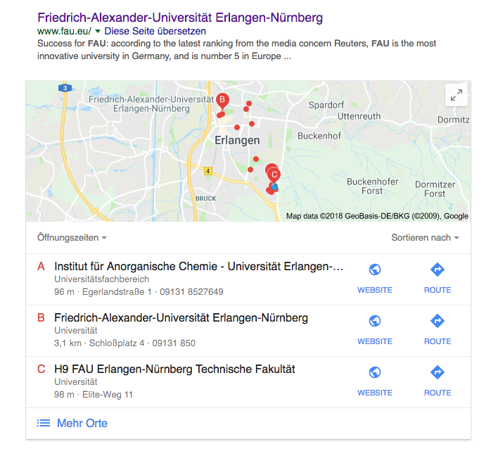
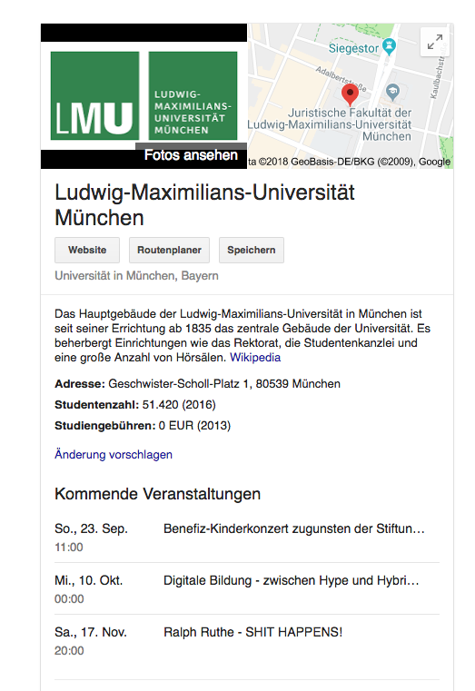

Entwicklung und Design 
=======================

## Aufgabenbereich und Zielgruppe

Dieser Anwendungsbereich betrifft die Entwicklung und das Webdesign von Webangeboten, Webauftritten und Apps. Teil der Entwicklung ist auch die Umsetzung und Bereitstellung von Templates und Musterseiten, die von
Autoren verwendet werden. Auch automatisch erstellte Ausgaben werden durch diese Zielgruppe definiert.

Dieses Kapitel wendet sich an folgende Personenkreise:

-   Webdesigner,
-   Webentwickler

## Grundlagen

Die Entwicklung von Webangeboten, Webauftritten und Apps ist abhängig von der jeweiligen Arbeitsweisen der Beteiligten, von definierten Workflows und Prozessen und von vorgegebenen Frameworks.
Der Leitfaden kann keine Empfehlungen zur Arbeitsorganisation und zum idealen Ablauf eines Webprojektes geben. Dies würde den Rahmen des Leitfadens deutlich sprengen. Daher werden an dieser Stelle nur die wichtigsten Problemfelder bei der Entwicklung und Bereitstellung von Webangeboten, Webauftritten und Apps angesprochen und für eine tiefergehende Beschäftigung auf relevante Webseiten verwiesen.

Ein umfangreiches Tutorial für die Entwicklung und Gestaltung von Webangeboten und Webauftritten bietet das  [Web Accessibility Tutorial des W3C](https://www.w3.org/WAI/tutorials/). Dieses sollte sowohl bei Neuentwicklungen als auch bei der Korrektur vorhandener Webangebote als Grundlage und Nachschlagewerk genommen werden.
Das Tutorial erläutert, wie Teile von Webangeboten erstellt werden können um sowohl die Konformität zur WCAG sicherzustellen, als auch die Benutzererfahrung für alle Nutzer einer Seite zu erhöhen.
Es gliedert sich in folgende Teile: 

* [Strukturierung und Layout](https://www.w3.org/WAI/tutorials/page-structure/)
* [Menüs und Navigationskonzepte](https://www.w3.org/WAI/tutorials/menus/)
* [Bilder](https://www.w3.org/WAI/tutorials/images/)
* [Tabellen](https://www.w3.org/WAI/tutorials/tables/)
* [Formulare](https://www.w3.org/WAI/tutorials/forms/)
* ["Carousels" (Slider, Wechselnde Artikel)](https://www.w3.org/WAI/tutorials/carousels/)

Weiterhin wurden für Designer und Entwickler weitere Empfehlungen und Hinweise zusammengefasst:

* [Tipps und Hinweise zum barrierefreien Webdesign](https://www.w3.org/WAI/tips/designing/)
* [Tipps und Hinweise zur Entwicklung von barrierefreien Markup](https://www.w3.org/WAI/design-develop/)  


Eine weitere hilfreiche Quelle ist die [Standards-Seite des W3C](https://www.w3.org/standards/): Die Plattform enthält ein umfangreiches Nachschlagewerk zur Entwciklung von  Webangeboten, Webauftritten, App aber auch von Schnittstellen, strukturierten Daten und Kommunikationsprotokollen.


## Umsetzung

Die wesentlichen Grundlagen und Beispiele zur Umsetzung werden in den oben genannten Tutorials behandelt. Hier folgen daher lediglich Umsetzungshilfen, die obige Tutorials ergänzen oder Sonderfälle betreffen. 


### Strukturierte Daten 


**Hinweis: Die Umsetzung von strukturierten Daten ist derzeit für die Umsetzung der Barrierefreiheit nicht erforderlich.** 
Gleichwohl kommt es dennoch zu positiven Auswirkungen in der Form, daß die Webseite durch Software besser analysiert werden kann. Dies führt unter anderem zu einer besseren Auffindbarkeit mit Hilfe von Suchmaschinen und somit wiederum dazu, daß Menschen die Inhalte besser finden, bevor sie überhaupt auf der Seite sind.

Strukturierte Daten erlauben es, die Semantik von HTML mit Hilfe standardisierter Anweisungen zu erweitern. HTML erlaubt zwar die Auszeichnung von Überschriften, Absätzen und Bildern, definiert jedoch keine Aussagen über den Inhalt. 
Menschen können Anhand von Kontext und Inhalt erkennen, worum es geht. Diese Möglichkeit hat Software (abseits von Machine Learning) jedoch nicht. 
Die in der [WAI-ARIA 1.1](https://www.w3.org/TR/wai-aria/) durch die W3C definierte Spezifikation kann dieses Problem auch nicht lösen. Die ARIA erlaubt zwar die Auszeichnung von Strukturen, Bedienelementen und Inhaltstypen einer Webseite, sie emacht aber keine Aussagen zur inhaltlichen Bedeutung.


Das Schema aus der Beschreibung des W3C zur [Spezifikation RDFa 1.1](https://www.w3.org/TR/rdfa-primer/) beschreibt das Problem: Auf der linken Seite ist das zu sehen, was die Browsersoftware sieht: Zwei Überschriften, einen mit `<em>` markierten Text und darunter ein Absatz. Gefolgt von eine Linkliste.

Ein Mensch hingegen interpretiert es als einen Artikel mit einer Hauptüberschrift, einer kleineren Überschrift zur Angabe des Autors, ein Datumsangabe und darauf folgend den eigenen Artikel. Gefolgt von einer Tagclound und einem Link zu Copyright-Informationen.

Suchmaschinen und spezialisierte Softwareprodukte werten strukturierte Datena auf Webseiten aus und liefern diese dann in geeigneter Weise an Menschen aus. So zum Beispiel:

- durch die Anreicherung der Ergebnisliste einer Suche mit Öffnungszeiten, Termine, lokaler Suche, hervorgehobenen Links;
- durch Auslesen von aktuellen Terminen aus Webseiten und Weiterverwendung dieser in anderen Anwendungen;
- durch die automatische Erkennung von Telefonnummern auf Webseiten und Verknüpfung dieser mit der Anrufsfunktion auf mobilen Devives.

Bei der Suche in Google wird beispielsweise bei der Suche nach der Universität Erlangen unterhalb einem Treffer auch eine Auswahlliste an Öffnungszeiten gezeigt. 


Und bei der Suche nach der LMU wird für diese im Infopanel eine Liste der kommenden Veranstaltungen angeboten.


Der Nebeneffekt dieser Anzeigen ist auch, daß der Benutzer der Suchmaschine ohne Umweg über die Startseite der jeweilige Webseite gleich zu dem jeweiligen Angebot springen kann.

In HTML geschieht die Auszeichnung dieser Inhalte durch die Attribute `itemscope` und `itemprop`. 

##### Beispiel Termin mit strukturierten Daten 

Ohne strukturierte Daten würde eine Terminangabe in HTML so aussehen:

```html
<div class="event">
	  <h2>Webkongress Erlangen</h2>
	  <em>12. September 2018, 9:00 Uhr</em>
	  Department Mathematik 
	  <address>  
			Cauerstraße 11
			91058 Erlangen
	  </address>
</div>
```

Mit Anwendung der [Schema.org-Beschreibung zu Terminen](https://schema.org/Event) wird hieraus folgendes:


```html
<div class="event" itemscope itemtype="http://schema.org/Event">
	  <h2>Webkongress Erlangen</h2>
	  <em itemprop="startDate" content="2018-09-12T09:00">12. September 2018, 9:00 Uhr</em>
	  <div class="event-venue" itemprop="location" itemscope itemtype="http://schema.org/Place">
		    <span itemprop="name">	Department Mathematik </span>
		    <address itemprop="address" itemscope itemtype="http://schema.org/PostalAddress">  
			 	<span itemprop="streetAddress">Cauerstraße 11</span>
				<span itemprop="postalCode">91058</span> <span itemprop="addressLocality">Erlangen</span>
		  	</address>
	   </div>
 </div>
```

Dieser HTML-Code kann von einer Software ausgelesen und interpretiert werden. Dabei spielt dann auch die individuelle Schreibweise bei der Datumsangabe keine Rolle mehr, da die standardisierte Form im Attribut
`content="2018-09-12T09:00"` angegeben wurde.
 
Auf der Seite [schema.org](https://schema.org/) findet sich eine Übersicht der gebräuchlichsten Inhaltstypen mit Beispielen für deren Anwendung. Um zu prüfen, ob die Angaben korrekt waren, kann das [Testtool von Google](https://search.google.com/structured-data/testing-tool?hl=de) aber auch die Browsererweitertung [Semantic Inspector](https://chrome.google.com/webstore/detail/semantic-inspector/jobakbebljifplmcapcooffdbdmfdbjh) (siehe unten) verwendet werde.
 

#### Vertiefung
- Schema.org: [Übersicht der Typen strukturierter Daten](https://schema.org/docs/schemas.html)
- Google: [Tutorial zu strukturierten Daten](https://developers.google.com/search/docs/guides/)
- lunapark: [Strukturierte Daten: Mehr Aufmerksamkeit in den SERPs](https://www.luna-park.de/blog/29207-strukturierte-daten/)
- t3n: [Rich Snippets](https://t3n.de/news/rich-snippets-anleitung-534054/)

### Browser-Add-ons

Bei dem Entwickeln und Testen von Websites können verschiedene Add-ons eine Hilfe sein.

Der Chrome-Browser von Google hat sich in den letzten Jahren zum meistgenutzten Browser weltweit entwickelt.
Auf dem Gebiet der Webentwicklung lag dies unter anderem auch wegen der im Vergleich zu Firefox besseren Unterstützung mit Hilfe von nativen Entwickler-Tools, aber auch aufgrund der besseren Unterstützung von Webstandards. (Siehe hierzu u.a. die Plattform [CanIuse.com](https://caniuse.com)). Mit dem neuen Firefox Quantum kann sich diese Situation wieder ändern, aber aktuell ist bei Webentwicklern der Chrome-Browser nach wie vor der am häufigsten verwendete Browser.
Unabhängig davon muss jeder Entwickler dennoch weitere Browser auf seinen Arbeitsplatzgeräten oder virtuellen Umgebungen haben. Neue Webauftritte sollten im Idealfall stets mit mindestens drei verschiedenen Browsern auf mindestens zwei verschiedenen Betriebssystemen getestet werden.

Die folgende Liste der Add-ons basiert auf dem aktuellen Chrome-Browser. Ähnliche oder auch dieselben AddOns gibt es jedoch auch auf anderen Browsern.


<table>
<tbody>
<tr>
<th>Name</th>
<th>Beschreibung</th>
<th>Link</th>
</tr>
<tr>
<th>CertViewer</th>
<td>Anzeige von Informationen zu dem SSL-Zertifikat einer Website.</td>
<td><a href="https://chrome.google.com/webstore/detail/certviewer/dcfpfgpnkmklbdnicbooifodgdekdgie">Download</a></td>
</tr>
<tr>
<th>ColorA11y</th>
<td>Dieses AddOn prüft ob bei einer Website die verwendeten Farben für Texte und Hintergründe den WCAG 2.0 Anforderungen genüge tun.</td>
<td><a href="https://chrome.google.com/webstore/detail/colora11y/icfneoldcbdmgaiocnnobpbbjncdfbfb">Download</a></td>
</tr>
<tr>
<th>ColorZilla</th>
<td>Dieses AddOn erlaubt das "Entnehmen" von Farbwerten aus einer aktuellen Website ("Color Picker") und bietet andere hilfreiche Informationen zur Farbauswahl an.</td>
<td><a href="https://chrome.google.com/webstore/detail/colorzilla/bhlhnicpbhignbdhedgjhgdocnmhomnp">Download</a></td>
</tr>
<tr>
<th>Full Page Screenshot</th>
<td>Für Protokoll- und Testzwecke oder der Diskussion von Bestandteilen einer Website ist ein Screencapture-Werkzeug unumgänglich.
Dieses Addon erlaubt das Erstellen von Screenshots einer ganzen Seite als auch dem gezielten Selektieren von Ausschnitten. Die jeweiligen Bilder können als Datei gespeichert werden.</td>
<td><a href="https://chrome.google.com/webstore/detail/full-page-screenshot/glgomjpomoahpeekneidkinhcfjnnhmb">Download</a></td>
</tr>
<tr>
<th>headingsMap</th>
<td>Anzeige der Überschriftenhierarchie einer Webseite. Diese Anzeige ist besonders wichtig um zu erkennen, ob die Navigation innerhalb einer Seite plausibel und logisch strukturiert ist. Auch dies wird zur Einhaltung der WCAG-Bedingungen erfordert.</td>
<td><a href="https://chrome.google.com/webstore/detail/headingsmap/flbjommegcjonpdmenkdiocclhjacmbi">Download</a></td>
</tr>
<tr>
<th>IP-Domain-Markierungsfahne</th>
<td>Dieses einfache Plugin ermittelt auf Basis bekannter IP-Adressebereiche die für die aktuell aufgerufene Domain jeweils wahrscheinlich passende Länderfahne.</td>
<td><a href="https://dnslytics.com/">Download</a></td>
</tr>
<tr>
<th>Semantic Inspector</th>
<td>Moderne Websites geben über die HTML-Semantik hinaus mit Hilfe von strukturierten Elementen (vgl. auch <a href="http://schema.org/">schema.org</a>) Aussagen darüber, aus welcher Art von Inhalten eine Seite und deren Bestandteile besteht. Insbesondere Suchmaschinen und UserAgents nutzen diese Formate um Informationen aus Webseiten auszulesen und entsprechend weiterzuverabeiten. Der Semantic Inspector macht diese Inhalte sichtbar und bietet damit gleichzeitig ein Testtool an, ob die selbst eingestellten strukturierten Elemente korrekt waren.</td>
<td><a href="https://chrome.google.com/webstore/detail/semantic-inspector/jobakbebljifplmcapcooffdbdmfdbjh">Download</a></td>
</tr>
<tr>
<th>WAVE Evaluation Tool</th>
<td>Dieses Tool ermöglicht einen automatisierten WCAG-Test der gerade besuchten Website. Die Ergebnisse sind hinreichend nutzbar für Tests und Entwicklung. Zu beachten ist jedoch, daß dieses Testtool, wie auch andere WCAG-Testtools auch viele "False Positives" meldet - also Dinge als Fehler markiert, die bei einer genaueren Prüfung sich doch als korrekt erweisen.</td>
<td><a href="https://chrome.google.com/webstore/detail/wave-evaluation-tool/jbbplnpkjmmeebjpijfedlgcdilocofh">Download</a></td>
</tr>
<tr>
<th>Web Developer</th>
<td>Dieses AddOn ergänzt die Toolbar um ein Button mit hilfreichen Informationen zur Website. So beispielsweise die semantische und topographische Gestaltung der Webseite. Auch werden weitere Links angeboten, mit denen man die W3C-Validation oder andere Werkzeuge bequem aufrufen kann.</td>
<td><a href="http://chrispederick.com/work/web-developer/">Download</a></td>
</tr>
</tbody>
</table>
Unabhängig von den AddOns wird der größte Teil der Entwicklung mit Hilfe des im Browser eingebauten Entwicklungswerkzeugs geleistet.
Die AddOns ergänzen dessen Funktionen nur oder machen spezielle Funktionen etwas bequemer zugänglich.


Üblicherweise sind weitere AddOns vorhanden, wie beispielsweise das uBlock Origin AddOn, welches effektiv Werbung unsichtbar macht bzw. das Laden dieser unterdrückt oder Ghostery, der (in Kombination mit uBlock Origin) ebenfalls ein gutes und datenschutzorientes Add-on zur digitalen Selbstverteidigung gegen Tracking und durch Werbung eingeschleuste Schadsoftware ist.