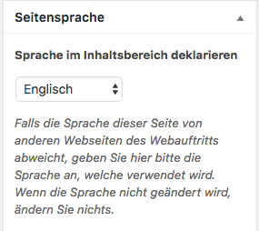

Status dieses Dokuments
=======================

::: {.alert .alert-primary role="alert"}
<strong>Dieser Leitfaden befindet sich momentan in der Entwicklung.
Inhalte der folgenden Kapitel sind provisorischer Natur und noch nicht
zur Weitergabe oder Nutzung gedacht.</strong>
:::

Vorwort
=======

Dieser Leitfaden soll Einrichtungen und Angehörigen der Hochschulen für
Angewandte Wissenschaft in Bayern eine „Erste Hilfe\" bei der Umsetzung
der Barrierefreiheit in der IT (Webangebote und Dokumente) geben. Aus
rechtlicher Sicht leitet sich der Begriff der Barrierefreiheit aus dem
Gleichheitsgrundsatz des Art. 3 GG ab. Dieser garantiert
Chancengleichheit und den Ausgleich bestehender Nachteile. Damit soll
die Teilnahme aller am öffentlichen Leben umgesetzt werden.

Der Leitfaden liefert einen Rahmen zur Einführung in das Thema der
digitalen Barrierefreiheit und eine allgemeine Handreichung. Eine
detaillierte und stets aktualisierte Dokumentation hinsichtlich der
technischen, organisatorischen und inhaltlichen Umsetzung kann nicht
gegeben werden. Stattdessen werden die jeweiligen Bereiche nach
Zielgruppen und Themen aufgegliedert und in diesen die jeweils
wichtigsten Handlungsempfehlungen aufgeführt. Für Details der Umsetzung,
sowie der Hintergründe, die der Vertiefung dienen, werden Links zu
relevanten Webseiten und Dokumentationen angegeben.

Einführung und Hintergründe
---------------------------

> „Barrierefreies Webdesign zielt darauf ab, Inhalte und Interaktionen
> im Netz für (möglichst) alle Nutzergruppen und Endgeräte zugänglich zu
> machen.\"
>
> <cite>(Charlier / Radtke, „Barrierefreies Webdesign\")</cite>.

Anders ausgedrückt bedeutet dies:

Jeder,

-   unabhängig von der jeweiligen Auffassungsgabe
-   unabhängig von der jeweiligen Methodik
-   unabhängig vom Gerät
-   unabhängig vom Betriebssystem
-   unabhängig von der Software

bekommt **beim Zugriff auf dieselbe Seite dieselben Inhalte angezeigt**.

Die Umsetzung dieses Prinzips nutzt nicht allein Menschen mit
Behinderungen. Auch neue Medien, neue Geräte und auch
Inhaltsaggregatoren (u.a. von Suchmaschinen), profitieren davon.

Besonders deutlich wird dies bei der stark gestiegenen Nutzung von
Smartphones und Tablet-Rechnern: Wurden noch vor 10 Jahren Webauftritte
nur über Desktop-Rechner abgerufen, so ist es heutzutage längst üblich
geworden, stattdessen auch mit Smartphones Informationen abzurufen.
Diese zeigen zwar moderne Webseiten nicht im selben optischen Design wie
auf einem großen Monitor, sie zeigen aber dennoch dieselben Inhalte.

Hier hat man also mit modernen Webseiten erfolgreich erreicht, dass
Webseiten unabhängig vom Gerät, dessen Betriebssystem oder der Software
abrufbar sind.

Die WCAG: Richtlinie für barrierefreie Inhalte
----------------------------------------------

Die Richtlinien für barrierefreie Webinhalte (WCAG: „Web Content
Accessibility Guildelines\", in [autorisierter deutscher Übersetzung der
Version 2.0](https://www.w3.org/Translations/WCAG20-de/) ) definieren,
wie man Inhalte für Menschen mit Behinderungen barrierefreier gestalten
kann.

Barrierefreiheit begegnet einem weiten Feld an Behinderungen,
einschließlich visueller, auditiver, motorischer, sprachlicher,
kognitiver, Sprach-, Lern- und neurologischer Behinderungen. Obwohl
diese Richtlinien viele Probleme abdecken, haben sie nicht auf alle
Arten, Ausprägungen und Kombinationen von Einschränkungen eine Antwort
und können nicht alle Bedürfnisse von Menschen mit Behinderungen
adressieren.

Darüber hinaus werden Webinhalte besser nutzbar für ältere Personen mit
sich altersbedingt ändernden Fähigkeiten, sowie für alle Benutzer im
alltäglichen Gebrauch. So sorgt eine barrierefreie Gestaltung von
Inhalten und Technik auch für eine deutlich verbesserte
Benutzerfreundlichkeit und eine deutlich bessere Auffindbarkeit von
Webseiten über gängige Suchmaschinen.

Die Richtlinien der WCAG wurden so konzipiert, dass sie sich weitgehend
auf verschiedene Webtechniken der Gegenwart und Zukunft anwenden lassen
sowie mit einer Kombination aus automatisierten Tests und der Evaluation
durch Menschen überprüfbar sind. Die WCAG ist hierzu auch öffentlich
zugänglich und wird ergänzt durch:

-   ausführliche Erläuterungen mit Anwendungsbeispielen,,
-   technische Tutorien,
-   die Bereitstellung von Testverfahren (u.a. die WCAG-EM),
-   die Auflistung anderer Werkzeuge und Verfahren.

Die WCAG geht zurück auf eine Empfehlung des W3C und der „Web Content
Accessibility Guildelines\" Arbeitsgruppe. Die WCAG wurde durch
das W3C-Verfahren
(<https://www.w3.org/WAI/standards-guidelines/w3c-process/>)  in
Kooperation mit Einzelpersonen und Organisationen auf der ganzen Welt
entwickelt. Die WCAG wird dabei stetig weiterentwickelt, um auch neue
Technologien und Entwicklungen zu berücksichtigen. Die letzte Version
der WCAG (<https://www.w3.org/TR/WCAG21/)> , die Version 2.1, wurde am
5. Juni 2018 als offizielle Empfehlung veröffentlicht.

Das Ziel des W3C ist es, mit dem WCAG einen gemeinsamen, international
abgestimmten Standard für die Barrierefreiheit von Webinhalten zur
Verfügung zu stellen, der die Bedürfnisse von Einzelpersonen,
Organisationen und Regierungen auf internationaler Ebene erfüllt.

Hier zeigt sich auch der Vorteil gegenüber kommerziell getriebenen
Empfehlungen und Zertifikaten einzelner Anbieter oder nationalen
Insellösungen wie der BITV, die sich zwar an der WCAG orientieren, diese
jedoch durch eigene Auslegungen und Einschränkungen abschwächen oder
auch andere Prioritäten setzen.

Die EU-Richtlinie 2016/2102 fordert für das Angebot von Webseiten
einschließlich von Dateiformaten aus Büroanwendungen (u.a.
PDF-Dokumenten) und Intranets hingegen die Einhaltung der WCAG, und zwar
auf der „Konformitätsstufe AA\" der WCAG 2.0.

Daher sollte zukünftig nur noch die Konformität zur WCAG als Maßstab für
die Umsetzung und Prüfung von Inhalten, Webangeboten und Dokumenten
verwendet werden und nicht mehr daraus abgeleitete oder interpretierte
Formen.

### Aufbau und Inhalt der WCAG

Die WCAG basiert auf vier grundlegenden Prinzipien, denen mehrere
Richtlinien zugeordnet sind. Zur Erfüllung dieser Richtlinien wurden
Erfolgskriterien (in der WCAG 2.0: 61, in der WCAG 2.1: 76) definiert,
mit denen geprüft werden kann, ob die Richtlinien eingehalten werden.

Aufgrund dieser ausführlichen und guten Literatur, wird hier darauf
verzichtet, weitere Ausführungen zu ergänzen. Wenn in den folgenden
Kapiteln auf einzelne Erfolgskriterien Bezug genommen wird, sind diese
gesondert gekennzeichnet.

Detailreiche Erläuterungen zum Aufbau der WCAG, deren Prinzipien,
Kriterien, Konformitätsbedingungen sowie der weitere Bestandteile,
können über folgende Seiten und Artikel gelesen werden:

-   W3C:
    -   WCAG 2.0 (W3C Original), <https://www.w3.org/TR/WCAG20/>
    -   Autorisierte deutsche Übersetzung der WCAG 2.0:
        <https://www.w3.org/Translations/WCAG20-de/>
    -   WCAG 2.1 (W3C Recommendation vom 5. Juni 2018),
        <https://www.w3.org/TR/WCAG21/>
    -   Web Accessibility Initiative, WAI, <https://www.w3.org/WAI/>
-   Jan Hellbusch:
    -   Richtlinien: WCAG 2.0,
        <https://www.barrierefreies-webdesign.de/wcag2/>

Gesetze, Verordnungen und Richtlinien
-------------------------------------

Die Barrierefreiheit von Webangeboten für Einrichtungen des öffentlichen
Dienstes ist seit der Verabschiedung des Bayerischen Gesetzes zur
Gleichstellung, Integration und Teilhabe von Menschen mit Behinderung
(BayBGG, <http://gesetze-bayern.de/Content/Document/BayBGG>) im Jahr
2003 verbindlich geregelt. Die dazugehörige Verordnung BayBITV
(<http://www.gesetze-bayern.de/Content/Document/BayBITV>) vom 24.
Oktober 2006 regelt hierbei verbindlich die Art der Umsetzung und
Fristen. Die entsprechenden Fristen zur Umsetzung der Barrierefreiheit
von Internet-Angeboten nach dem bisherigen BayBGG sind seit 2010
abgelaufen.

Gleichwohl wurden diese gesetzlichen Vorgaben bis heute nicht bei vielen
Webangeboten erfüllt.

Das Problem der mangelnden Umsetzung und der Wunsch nach Harmonisierung
der Gesetzgebung auf EU-Ebene führte zum Erlass der Richtlinie
2016/2102. Aus diesem Grund wurde eine Richtlinie entworfen, die sich
dieses Problems annahm: Am 18.7.2016 wurde auf EU-Ministerratsebene die
"Web-Accessibility-Richtlinie" angenommen, die nach der darauf folgenden
Annahme von Rat und Parlament am 20. Tag nach ihrer Veröffentlichung im
Amtsblatt der EU (ABl. L 327, 2. Dezember 2016) - am 22. Dezember 2016 -
in Kraft trat.

Mit der Richtlinie soll eine Angleichung der Rechts- und
Verwaltungsvorschriften der Mitgliedstaaten zum barrierefreien Zugang zu
Webseiten öffentlicher Stellen erfolgen. Dies soll dabei unterstützen,
die nationalen Verpflichtungen hinsichtlich eines barrierefreien
Webzugangs zu erfüllen und das Bekenntnis der Mitgliedstaaten zum
Übereinkommen der Vereinten Nationen über die Rechte von Menschen mit
Behinderungen in Bezug auf die Websites öffentlicher Stellen zu
bekräftigen. Gegenstand der vorgeschlagenen Richtlinie sind sowohl
Webseiten, als auch Dokumente und Apps öffentlicher Stellen, da sie
Informationen und Dienste bereitstellen, die für Bürgerinnen und Bürger
von grundlegender Bedeutung sind.

In technischer Hinsicht gilt als Richtschnur die Erfüllung des
Konformitätslevels AA der [Richtlinien für barrierefreie Webinhalte (Web
Content Accessibility Guidelines - WCAG
2.0)](https://www.ag.bka.gv.at/at.gv.bka.wiki-bka/index.php/WCAG20), wie
sie in der Europäischen Norm ([Europäischer Standard EN 301 549 -
Anforderungen an Barrierefreiheit bei der Beschaffung von IKT-Produkten
und
Dienstleistungen](https://www.ag.bka.gv.at/at.gv.bka.wiki-bka/index.php/Barrierefrei:EN_301_549))
enthalten sind. 

Aufgrund der im Juni 2018 veröffentlichten neuen Version 2.1 der WCAG,
ist es möglich, dass die Europäische Norm in Kürze um die zusätzlichen
Erfolgskriterien aktualisiert wird. Es ist daher in Erwägung zu ziehen,
sich bereits jetzt an die WCAG 2.1 zu halten. Dieser Leitfaden wird bei
den Empfehlungen, die nicht durch die WCAG 2.0 gefordert, aber in der
WCAG 2.1 enthalten sind, jeweils einen entsprechenden Hinweis setzen.

Anwendungsbereiche
==================

Dieser Leitfaden wird unterteilt in die Anforderungen unterschiedlicher
Zielgruppen und Aufgabengebiete. Je nachdem gelten verschiedene
Empfehlungen oder Anforderungen, die sich aus der EU Richtlinie oder der
WCAG ergeben.

1.  Bereitstellung und Pflege von Inhalten
    -   für: *Redakteure und Autoren von Webinhalten*
2.  Entwicklung und Design
    -   für: *Webentwickler und Webdesigner*
3.  Organisatorische und rechtliche Anforderungen
    -   für: *Verantwortliche Betreiber von Webauftritten, Auftraggeber,
        Entscheider*
4.  Satzungen, Prüfungsordnungen, Dienstanweisungen
    -   für: *Bearbeiter aus Prüfungsämtern und Rechtsabteilungen, sowie
        Verwaltungsmitarbeiter*

Die einzelnen Kapitel orientieren sich im Aufbau nach den Anforderungen
und Tätigkeiten der jeweiligen Zielgruppen. Dabei wird auch von der
Reihenfolge abgewichen, die sich durch die WCAG (Sortierung gemäß den
Richtlinien „Wahrnehmbar", „Bedienbar", „Verständlich", „Robust")
ergibt.

Zur Umsetzung können die jeweiligen Kapitel auch getrennt voneinander
weitergegeben werden.

Bereitstellung und Pflege von Inhalten
======================================

Aufgabenbereich und Zielgruppe
------------------------------

Dieser Anwendungsbereich betrifft die Erstellung von Pflege von Inhalten
auf Webauftritten von Hochschulen, deren Einrichtungen, Lehrstühlen,
Projekten und anderen Informationsseiten.

Dieses Kapitel wendet sich an folgende Personenkreise:

-   Redakteure
-   Autoren
-   Fotoredakteure und
-   sonstige Bearbeiter von Inhalten.

Es wird davon ausgegangen, dass Webangebote in diesen Bereichen über ein
geeignetes Content-Management-System verwaltet werden, das über
Eingabeverfahren mit Hilfe von einem WYSIWYG- oder zumindest Text-Editor
verfügt, in dem einfache HTML-Anweisungen eingegeben werden können.

**Abgrenzung: Die Programmierung von CMS oder die optische und
technische Gestaltung der Ausgaben über HTML, CSS und JavaScript ist
nicht Teil dieses Kapitels.**

Grundlagen
----------

Mit Inhalten sind all die Informationen gemeint, die vom Leser
wahrgenommen werden müssen. Zur besseren Darstellung und Strukturierung
der Inhalte wird auf Webseiten die Strukturierungssprache HTML
verwendet. Mit dieser kann auch die inhaltliche Bedeutung eindeutig
definiert werden, wozu auch nur wenige, leicht zu merkendende Elemente
notwendig sind: Nämlich die Elemente für Überschriften, Absätze, Bilder,
Listenelemente, Zitate und Tabellen. In HTML nutzt man den Begriff der
[Semantik](https://blog.kulturbanause.de/2008/01/html-elemente-und-semantik/).

Wichtig hierbei ist jedoch, dass die Semantik eingehalten wird:
Überschriften, die nicht mittels der verfügbaren HTML-Elementen als
solche gekennzeichnet sind, sind keine. Der „klassische Fehler\" vieler
Autoren besteht dann auch darin, dass keine Überschriften gesetzt
wurden, sondern eine Textzeile schlicht mit Fettdruck und einer größeren
Schrift optisch hervorgehoben wurde. Semantisch sind solche
Überschriften eben keine und werden daher auch nicht als solche
interpretiert: Screenreader können diese nicht von normalem Text
unterscheiden und auch die Analyse von Suchmaschinen wird hier den
Inhalt dieser Zeile nicht als hervorhebenswerte Überschrift einstufen.
Der Fettdruck und die Schriftgröße werden lediglich als optische
Darstellung interpretiert; Eine *automatische Erkennung*, dass hier eine
Überschrift gemeint sei, passiert nicht. Diese Interpretation fand
allein im Auge des Autors statt.

Optionale Teile und Formatierungsanweisungen, die nur dazu dienen, die
Anzeige der Inhalte optisch präsentabler zu gestalten, sind keine
Inhalte, die eine notwendig zu übermittelnde Botschaft tragen.

Auf Webseiten, aber auch auf Flyern und anderen Print-Produkten erfolgt
sehr häufig eine optische Verschönerung durch sogenannte
*Schmuckgrafiken*. Da diese Grafiken jedoch keine inhaltliche Aussage
übermitteln, können sie jederzeit auch weggelassen oder ausgetauscht
werden. Mit diesem Verständnis kann man solche Grafiken auch von
Schemagrafiken, Auswertungen oder anderen Grafiken unterscheiden:
Schmuckgrafiken können jederzeit ausgetauscht oder weggelassen werden,
während Grafiken, die einen Inhalt tragen, nicht wegzulassender
Bestandteil der Seite sind.

Ein weiterer häufiger Fehler neben dem, keine Semantik zu verwenden, ist
es, eine Semantik falsch zu verwenden mit dem Ziel eine optische
Darstellung zu erlangen:

So zum Beispiel verwenden einige Autoren gern Überschriften, um einen in
ihren Augen wichtigen Text hervorzuheben. Ebenso häufig ist der Fehler,
eine Überschrift einer bestimmten Ebene nur deswegen zu verwenden, weil
sie dem Autor in der jeweiligen Größe besser gefällt als die Überschrift
in ihrer korrekten Ebene. Oder es werden Tabellen verwendet, um eine
rein optische Ausrichtung des Textes zu erlangen.

Wenn eine optische Hervorhebung von Texten gewünscht ist, dürfen hierzu
keine Strukturelemente, die für die inhaltliche Kennzeichnung vorgesehen
sind, verwendet werden. Wenn ein Absatz oder einzelne Worte optisch
hervorgehoben werden sollen, ist es Sache des Webdesigns, eine
entsprechende Funktionalität bereitzustellen. Viele Webdesigns enthalten
bereits entsprechende Funktionalitäten für optionale Boxen, Spaltensatz,
Hinweismarken oder Buttons. Sollte eine entsprechende Dokumentation oder
ein Styleguide vorhanden sein, sollten diese konsultiert werden.

Umsetzung
---------

### Überschriften und Überschriftshierachien

Inhalte beginnen üblicherweise mit einer Überschrift, gefolgt von einem
oder mehren Absätzen. Beim Schreiben von längeren Texten ist eine
logische Überschriftenhierachie wichtig: Die erste Überschrift im
Dokument ist eine Überschrift der Ebene 1. Ist der Text hierarchisch
gegliedert, folgt ein Absatz mit einer Überschrift der Ebene 2. Besteht
dieses Kapitel aus weiteren hierarchisch untergeordneten Kapitel folgen
hier die Überschriften der Ebene 3 und so weiter.

In HTML wird die Überschrift der ersten Ebene mit `<h1>` deklariert, die
zweite Ebene mit `<h2>`, die dritte mit `<h3>` und so weiter bis zur
sechsten Ebene. Wird in einem CMS ein WYSIWYG-Editor wie beispielsweise
der populäre TinyMCE-Editor angeboten, werden die Überschriften als
Absatzvorlagen angeboten. Diese werden nach der Eingabe in dem Editor in
die entsprechende HTML-Variante gesetzt.


Bei einigen CMS und Redaktionssystemen wurde die Überschrift der ersten
Ebene aus den Absatzvorlagen entfernt, wie es auch das obige Bild zeigt.
Grund hierfür ist, dass viele Webseiten in der Ausgabe den Titel der
Seite als erste Überschrift ausgeben.

Die Überschriften sind nur in ihrer logischen Struktur zu nutzen und
nicht als Hilfsmittel zur optischen Formatierung der Texte. Wie eine
Überschrift einer beliebigen Ebene optisch auf einem Browser, in einem
Officedokument oder einem Ausdruck aussieht, ist Sache des Corporate
Designs oder der zugrundeliegenden Dokumentenvorlage. Wenn die optische
Darstellung nicht passend erscheint, so ist nicht die
Überschriftenhierachie zu ändern, sondern das Corporate Design bzw. die
Dokumentenvorlage. Als Redakteur oder Autor einer Webseite oder eines
Dokumentes sollte man sich jedoch grundsätzlich nicht um die optische
Gestaltung der Inhalte kümmern und daher auch nicht versuchen, diese zu
beeinflussen.

Die logische Reihenfolge von Überschriftenhierachien ist von hoher
Bedeutung bei der barrierefreien Umsetzung von Webseiten und Dokumenten:
Die Überschriften sind für Screenreader-Software ein unverzichtbares
Mittel, um innerhalb der Seite zu navigieren. Die Software erkennt
Überschriften anhand der korrekten HTML-Markierung und bietet dem
(blinden) Leser der Seite die Möglichkeit an, von Kapitel zu Kapitel zu
springen. Sind die Kapitel jedoch nicht mit Überschriften versehen oder
mit Überschriften der falschen Hierachieebene, funktioniert dies nicht.
Barrierefreie Webseiten setzen die Überschriftenhierachie nicht nur für
den Inhaltsbereich um, sondern gliedern auch alle anderen Bestandteile
der Webseite in einer passenden Hierachie. Mit einem Browser-Addon, wie
beispielsweise
[HeadingsMap](https://chrome.google.com/webstore/detail/headingsmap/flbjommegcjonpdmenkdiocclhjacmbi),
kann man sich die Überschriftenhierachie einer Webseite gesondert
anzeigen lassen.


Neben Screenreadern nutzen auch Suchmaschinen die Überschriften und
deren logische Abfolge zur Einordnung von Inhalten. Wenn Sie also Wert
darauf legen, dass eine Information besser gefunden wird, sollten Sie
auf eine hierachische Gliederung des Inhalts achten.

#### Verpflichtende Erfolgskriterien

-   [1.3.1 Info und
    Beziehungen](https://www.w3.org/WAI/WCAG21/quickref/#info-and-relationships)
    (Stufe A)
-   [2.4.6 Überschriften und
    Labels](https://www.w3.org/WAI/WCAG21/quickref/#headings-and-labels)
    (Stufe AA)

#### Optionale Erfolgskriterien

-   [2.4.10
    Abschnittsüberschriften](https://www.w3.org/WAI/WCAG21/quickref/#section-headings)
    (Stufe AAA)

### Absätze und andere Textbereiche

Beim Schreiben von Text für Webseiten gelten dieselben Regeln wie auch
bei jeder anderen Publikation oder wissenschaftlichen Arbeit: Der Text
muss für die jeweilige Zielgruppe verständlich sein, klar strukturiert
und frei von Rechtsschreibfehlern. Dabei sollte man jedoch nicht davon
ausgehen, dass der Leser der Webseite denselben Kenntnisstand hat wie
der Autor. Abkürzungen, interne Begriffe und Codewörter, die im Umfeld
des Autors oder in Projekten alltäglich verwendet werden, müssen für
andere nicht bekannt sein. Zudem können dieselben Abkürzungen je nach
Umfeld und Kontext auch verschiedene Bedeutungen haben. Bei einem
längeren Text bietet es sich zudem an, im allerersten Absatz eine kurze
Zusammenfassung oder eine Einführung zu schreiben. Die WCAG selbst
fordert die Verständlichkeit von Texten.

Jan Eric Hellbusch schreibt zur
[Verständlichkeit](https://www.barrierefreies-webdesign.de/knowhow/verstaendliche-inhalte/):
\> Textverstehen ist ein aktiver Prozess und eine Interaktion zwischen
Text und Leser. Texte sind für unterschiedliche Leser unterschiedlich
leicht verstehbar. Dies hat sowohl mit den Interessen und dem Vorwissen
des Lesers zu tun, als auch mit dessen individuellen Fähigkeiten.
Aufgrund der unterschiedlichen Voraussetzungen können Texte nicht für
alle Leser gleichermaßen verständlich gemacht werden. Dennoch können
Voraussetzungen geschaffen werden, die zur Textverständlichkeit
beitragen und die Zugänglichkeit der Inhalte auf der
Verständlichkeitsebene fördern. Hierzu zählen redaktionelle Aspekte wie
die Verwendung geläufiger Begriffe oder kurzer Sätze und gestalterische
Maßnahmen wie das Vermeiden von Blocksatz und die Berücksichtigung von
relativen Schriftgrößen und höheren Zeilenabständen. Auch die Verwendung
von Zwischenüberschriften gehört zu den Anforderungen der
Verständlichkeit

#### Sprache

Ein Text wird üblicherweise in nur einer Sprache geschrieben. Auch wenn
die Sprache für einen Leser offensichtlich erscheint, muss die Sprache
der Webseite als Ganzes und optional auch in Teilen von Texten angegeben
werden. Für die Definition der gesamten Seite in einer Sprache ist bei
modernen Webauftritten das jeweilige CMS zuständig. Je nach Einstellung
des Webauftritts wird dabei vorgegeben, welches die Hauptsprache des
Webauftritts und damit auch der Inhalte ist. Als Autor oder Redakteur
kann man diese *globale* Einstellung normalerweise nicht ändern. Unter
Umständen bieten manche CMS Installationen die Option an, die Sprache
einer einzelnen Inhaltseite gesondert anzugeben:



Auch wenn die Angabe der Sprache für einen *sehenden Leser* unnötig
erscheint, ist sie dennoch von großer Bedeutung:

-   Screenreader lesen den Text vor. Damit der Text jedoch in der
    richtigen Sprache und in der korrekten Aussprache vorgelesen werden
    kann, muss die Screenreader-Software auch erkennen können, um welche
    Sprache es sich handelt. Eine automatische Erkennung ist zwar nicht
    unmöglich, sie ist jedoch nicht zuverlässig. Zumal dann, wenn die
    Hauptsprache des Webauftritts ebenfalls angegeben wurde und sich von
    der Sprache des Textabschnitts unterscheidet.
-   Neben Menschen besuchen auch Suchmaschinen und Inhaltsaggregatoren
    die Webseiten. Auch diese versuchen, den Inhalt zu interpretieren
    und verwenden zur Einordnung und Erkennung von Keywords und
    Synonymen die angegebene Sprache. Ist die Sprache nicht oder falsch
    angegeben, kann der Inhalt falsch zugeordnet werden, was in der
    Praxis bedeuten kann, dass die Seite in der Ergebisliste einer
    Suchmaschine an einer schlechten Position aufgelistet wird.

Gibt das CMS oder dessen Bearbeitungswerkzeuge keine Optionen vor, um
die Sprache der Inhaltsbereiche anzugeben, ist diese mittels HTML zu
setzen. Hierzu eignet sich das Attribut *lang=\"\"* welches in dem
HTML-Element angegeben wird, das den Text mit der Sprache umgibt.
Handelt es sich nur um einen Absatz, kann man das `<p>`; Element nutzen,
handelt es sich um ein längeres Zitat, verwendet man das `<blockquote>`
Element.

Beispiel mit zwei Absätzen. Der erste gibt keine Sprachdefinition an.
Der zweite Absatz setzt die Sprache auf Englisch:

``` {.html}
    <p>
      Dies ist ein Absatz ohne Sprachdeklaration. Es wird die Sprache verwendet, 
      die vom CMS bzw. dem Webseitentemplate im head-Bereich der Seite 
      angegeben wurde.
   </p>
   <p lang="en">
      This is an Englisch paragraph.
   </p> 
```

Sollte sich der Textbereich über mehrere Kapitel und Absätze erstrecken,
setzt man die Sprachdefinition nicht in jedem einzelnen Absatz neu,
sondern verwendet das Element `<div>` um alle darin liegenden Absätze zu
deklarieren:

``` {.html}
   <h1>Text in einer deutschsprachigen Seite mit englischen Absätzen</h1>
   <p>
      Dies ist ein Absatz ohne Sprachdeklaration. Es wird die Sprache verwendet, 
      die vom CMS bzw. dem Webseitentemplate im head-Bereich der Seite 
      angegeben wurde.
   </p>
   <div lang="en">
       <h2>Chapter One</h2>
       <p>
           This is an Englisch paragraph in chapter one.
       </p> 

       <h2>Chapter Two</h2>
       <p>
           This is the first paragraph in chapter two.
       </p> 
       <p>
           This is the second paragraph in chapter two.
       </p>
   </div> 
```

#### Abkürzungen

Bei der Verwendung von Abkürzungen sollte man grundsätzlich folgende
Dinge beachten:

-   Bei der Verwendung von Abkürzungen sollten diese bei dem ersten
    Auftreten im Text ausgeschrieben werden. Dies gilt besonders bei
    längeren Namen von Einrichtungen oder Titeln. Dabei wird zunächst
    der Name ausgeschrieben, gefolgt von der Abkürzung in runden
    Klammern. Beispiel: *Friedrich-Alexander-Universität
    Erlangen-Nürnberg (FAU)*.
-   Eine Ausnahme gibt es hingegen bei solchen Abkürzungen, die in der
    kurzen Form bereits Teil der Alltagssprache, in ihrer
    ausgeschriebenen Form hingegen jedoch weitgehend unbekannt sind. So
    zum Beispiel die Abkürzungen "DSL" oder "WLAN". Die ausgeschriebenen
    Formen dieser Abkürzungen ("*[Digital Subscriber Line]{lang="en"}*"
    und "*[Wireless Local Area Network]{lang="en"}*") sind oft nicht
    gängig, während die Bedeutung der kurzen Form für jeden Leser klar
    ist.
-   Sollte bei der Ausschreibung der Abkürzung ein Sprachwechsel
    erfolgen, muss diese über geeignete HTML-Anweisungen im Code
    deklariert werden. Hierzu eignet sich das Attribut *lang=\"\"*.

##### Beispiele:

Bei der Ausschreibung von *WLAN* sähe der entsprechende HTML-Code daher
so aus:

``` {.html}
   <span lang="en">Digital Subscriber Line</span>
```

Wird die Abkürzung nicht ausgeschrieben, wird das `<abbr>`-Element
verwendet um sie als solche zu deklarieren:

``` {.html}
<abbr title="zum Beispiel">z.B.</abbr>
```

Kommt es dabei zudem zu einem Sprachwechsel, wird das Attribut
*lang=\"\"* ergänzt; Als Inhalt des Attributs wird der jeweilige [Code
der
Sprache](https://www.w3.org/International/questions/qa-html-language-declarations.de)
der Abkürzung verwenden:

``` {.html}
<abbr title="World Wide Web" lang="en">WWW<abbr>
```

#### Verpflichtende Erfolgskriterien

-   [3.1.1 Sprache der
    Seite](https://www.w3.org/WAI/WCAG21/quickref/#language-of-page)
    (Stufe A)
-   [3.1.2 Sprache von
    Teilen](https://www.w3.org/WAI/WCAG21/quickref/#language-of-parts)
    (Stufe AA)

#### Optionale Erfolgskriterien

-   [3.1.3 Ungewöhnliche
    Wörter](https://www.w3.org/WAI/WCAG21/quickref/#unusual-words)
    (Stufe AAA)
-   [3.1.4
    Abkürzungen](https://www.w3.org/WAI/WCAG21/quickref/#abbreviations)
    (Stufe AAA)
-   [3.1.5
    Leseniveau](https://www.w3.org/WAI/WCAG21/quickref/#reading-level)
    (Stufe AAA)
-   [3.1.6
    Aussprache](https://www.w3.org/WAI/WCAG21/quickref/#pronunciation)
    (Stufe AAA)

#### Vertiefung

-   Jan Eric Hellbusch:
    [Sprachangabe](https://www.barrierefreies-webdesign.de/knowhow/sprachangabe/)

### Bilder und Schemagrafiken

Mit Hilfe von Bildern und Schemagrafiken können viele Informationen an
den Leser übermittelt werden: Inhaltliche Informationen und Daten, aber
auch Stimmungen. Im letzteren Fall wird oft von sogenannten
*Schmuckgrafiken* oder von *dekorativen Elementen* gesprochen: Die
Bilder tragen in sich keinen eigentlichen Inhalt, sondern dienen
schlicht dazu, die Webseite für einen sehenden Leser oder für den
Ausdruck optisch ansprechend zu gestalten. Würde man diese Bilder
weglassen, würde der Leser keine Information vermissen. Dem gegenüber
stehen Bilder und Schemagrafiken, die tatsächlich Informationen
enthalten. Würde man diese Bilder ausblenden, würden wesentliche
Informationen fehlen oder gar die gesamte Seite inhaltsleer sein.

Für die Barrierefreiheit ist es wichtig, dass Bilder und Schemagrafiken
entweder im Text erklärt werden, so dass man auch ohne diese auskommt,
oder dass die Bilder über eine geeignete Textalternative verfügen. Die
Textalternative muss die gesamte vom Bild übermittelte Information
enthalten.

Die Art der Textalternative ist dabei abhängig von der Art des Bildes:

-   Handelt es sich um eine Schmuckgrafik, so sollte keine
    Textalternative angegeben werden. Screenreader sollen diese Bilder
    ignorieren; Eine Beschreibung ist daher wegzulassen.
-   Handelt es sich um eine Illustration eines im Text beschriebenen
    Sachverhaltes, ist lediglich eine kurze Textbeschreibung notwendig.
-   Wenn es sich bei dem Bild um ein informatives Bild handelt, welches
    nicht im Text beschrieben wird, ist eine ausführliche
    Textalternative für das Bild zu hinterlegen.
-   Handelt es sich bei dem Bild um ein aktives Element um auf eine
    andere Webseite zu verlinken oder als grafischer Button eine Aktion
    auszulösen, ist nicht das Bild inhaltlich zu beschreiben, sondern
    das Linkziel oder das was passiert, wenn man auf das Bild klickt.

Um eine Textalternative eines Bildes anzugeben, verwendet man im
HTML-Element `` die Attribute *alt=\"\"* und *title=\"\"*.
Unterstützt das CMS des Webauftritts auch Bildunterschriften, sind auch
diese anzugeben, sofern das Bild keine Schmuckgrafik ist.

#### Beispiele:

1.  Die Wikipedia-Seite zur [Mona
    Lisa](https://de.wikipedia.org/wiki/Mona_Lisa) beschreibt das
    gleichnamige Bild von Leonardo da Vinci. Wenn man das Bild nun in
    einer Seite einbinden möchte, könnte man folgende HTML-Anweisung
    nutzen:

    ``` {.html}
    
    ```

    Hier wird als Textalternative für das Bild der Text *Gemälde der
    Mona Lisa (La Joconde) von Leonardo da Vinci* angegeben, während der
    Titel schlicht *Mona Lisa* ist. Gleichwohl wäre diese Beschreibung
    als Ersatz sehr knapp - auch für sehende Menschen. Es fehlt an
    weiteren Informationen über das Bild. Diese sollte man entweder im
    dem Bild umrandenden Text angeben oder verlinken. Das Attribut
    *alt=\"\"* sollte hingegen nicht für Essays verwendet werden. Der
    Alternativtext im Bild-Element soll zweckmäßig sein und die Länge
    von 80 Zeichen nicht überschreiten. Handelt es sich bei den Bilder
    um ein Foto mit Personen oder Gegenstände, sollte man diese im
    Alternativtext namentlich angeben.

2.  Bei einem dekorativen Bild wird das Attribut *alt=\"\"* leer
    gelassen:

    ``` {.html}
    
    ```

3.  Bei einem grafischen Link wird hingegen das Linkziel beschrieben und
    nicht mehr das Bild:

    ``` {.html}
    <a href="https://www.fau.de"></a>
    ```

#### Verpflichtende Erfolgskriterien

-   [1.1.1
    Nicht-Text-Inhalt](https://www.w3.org/WAI/WCAG21/quickref/#non-text-content)
    (Stufe A)
-   [2.4.4 Linkzweck (im
    Kontext)](https://www.w3.org/WAI/WCAG21/quickref/#link-purpose-in-context)
    (Stufe A)

#### Vertiefung

-   Jan Eric Hellbusch: [Informative
    Bilder](https://www.barrierefreies-webdesign.de/knowhow/textalternative/informative-bilder.html)
-   Jan Eric Hellbusch: [Entscheidungsschema für Textalternativen von
    Bildern](https://www.barrierefreies-webdesign.de/knowhow/textalternative/entscheidungsschema.html)

### Links

Abseits von den Menüs und Navigationskonzepten einer Website werden auch
Links im Inhaltsbereich von Seiten gesetzt. Auch wenn das eigentliche
Setzen von Links nicht schwierig ist, können einige Fehler gemacht
werden, welche negative Auswirkungen auf Barrierefreiheit, Verständnis
und auch Findbarkeit haben.

Folgende Eigenschaften muss jeder Link erfüllen:

-   Ein Link sollte grundsätzlich immer klar und deutlich machen, was
    den Leser erwartet, wenn er diesen auswählt. Und zwar schon vor dem
    "Klick" und auch vor einem *mouseover*.
-   Ein Link muss auch immer für sich allein genommen verständlich sein.
    So muss er auch dann, wenn er allein und ohne umgebenden Text
    ausgegeben wird, noch immer das Ziel und seinen Zweck klar
    beschreiben.

Verlinkt man auf eine andere Webseite, ist der Linktext optimalerweise
der Titel der Webseite. Verlinkt man auf ein Dokument, so wird der Titel
des Dokumentes verwendet. Keinesfalls sollte man als Linktext jedoch
Handlungsanweisungen verwenden. Ein Klassiker bei fehlerhaften
Umsetzungen ist ein Link wie dieser: "*Klicken Sie **hier***" . Das Wort
"**hier**" für sich allein genommen sagt nichts darüber aus, was
passiert, wenn man tatsächlich auf den Link klickt. Stattdessen sollte
an solchen Stellen besser so formuliert werden: "*Rufen Sie die
**Online-Broschüre zum Thema ABC** auf.*". Der eigentliche Link wäre
dann auf den Worten "**Online-Broschüre zum Thema ABC**". Dies ist ohne
den Text davor auch für sich allein verständlich und der Leser wird
wissen, was ihn beim Klick auf den Link erwartet.

Im normalen Textbereichen wird ein Link mit den HTML-Element `<a>`
gesetzt:

``` {.html}
Rufen Sie die <a href="(URL)"><Online-Broschüre zum Thema ABC</a> auf.
```

Bei Nutzung eines WYSIWYG-Editors reicht es oft, den entsprechenden Text
zu selektieren und dann in einem erscheinenden Fenster die Zieladresse
einzugeben oder aus einer Liste vorhandener Seiten auszuwählen.


#### Weitere Attribute

Zu beachten ist, dass im Fall einfacher Links auf Dokumente keine
weiteren Angaben oder Attribute notwendig sind. Auch die Angabe, welche
dafür sorgt, dass ein Link in einem neuen Fenster oder Tab geöffnet
wird, sollte vermieden werden. Man kann nicht davon ausgehen, dass das
Öffnen eines neuen Fensters für Links von jedem Leser erwünscht ist.
Tatsächlich sorgt das Öffnen eines neuen Fensters auch zu einigen
Nachteilen bei den Lesern der Seite: Die *"Zurück"-Funktion* des Browser
funktioniert für das neue Fenster nicht mehr und der Rechner wird
möglicherweise durch viele neue Fenster stärker belastet. Wurde die
Seite zudem mit einem Smartphone aufgerufen, wird das neue Fenster
üblicherweise das vorherige komplett überlagern. Ob ein neues Fenster
oder ein Tab geöffnet wird, sollte daher grundsätzlich dem Leser selbst
überlassen bleiben, der hierfür die dafür gedachten Werkzeuge seines
Browsers nutzen kann.

Auf manchen Webseiten sieht man, dass Links zusätzlich mit einem
*title=\"\"*-Attribut versehen wurden. Dies sollte man ebenfalls nur in
besonderen Ausnahmefällen tun. Das Attribut sollte nur dann verwendet
werden, wenn der Linktext nicht gleich dem tatsächlichen Titel des
aufzurufenden Dokumentes ist. Screenreader werden bei einem Link
üblicherweise sowohl den Title, sofern vorhanden, als auch den Linktext
vorlesen. Sind Linktext und Titel dagegen gleich, werden Menschen mit
Screenreader daher denselben Text unnötigerweise zweimal anhören müssen.

#### Verpflichtende Erfolgskriterien

-   [2.4.4 Linkzweck (im
    Kontext)](https://www.w3.org/WAI/WCAG21/quickref/#link-purpose-in-context)
    (Stufe A)

#### Optionale Erfolgskriterien

-   [2.4.9 Linkzweck (reiner
    Link)](https://www.w3.org/WAI/WCAG21/quickref/?showtechniques=249#link-purpose-link-only)
    (Stufe AAA)

### Tabellen

Für die Nutzung von Tabellen gilt eine feste Regel: **Tabellen dürfen
nur für tabellarische Daten genutzt werden.** Tabellen sind nicht dazu
gedacht, Texte und Bilder auszurichten oder die Seite zu layouten. Es
gilt auch hier das oben Genannte: Wenn eine besondere optische
Darstellung benötigt wird, so ist es Aufgabe des Designs und der
Technik, entsprechende Funktionalitäten bereitzustellen. Wird
beispielsweise eine Ausrichtung des Inhaltes in zwei oder mehr Spalten
gewünscht, wird dies bei modernen Websites oft durch eigene Anweisungen
geleistet. So verfügen beispielsweise Websites, die auf dem populären
Bootstrap-Framework beruhen, eine umfangreiche Klassenbibliothek um
Inhaltsbereiche in bis zu 12 Spalten aufzutrennen. Eine Tabelle erweist
sich bei der Nutzung als Gestaltungswerkzeug spätestens bei dem Aufruf
der Seite mit dem Smartphone als untauglich: So werden dann Inhalte
nicht mehr erkennbar und es kommt zu horizonatlen Scrollbalken. Wird
hingegen ein vorgegebenes Grid-System verwendet, werden die Spalten
serialisiert und in korrekter Reihenfolge übereinander positioniert.

Bei der Nutzung von Datentabellen ist den jeweiligen Zellen eine
Überschrift zuzuordnen. Dies erfolgt mit Hilfe des Elements `<th>`. Die
eigentlichen Zellen mit Daten werden dagegen mit dem Element `<td>`
gekennzeichnet. Die Zeilen werden durch das Element `<tr>`
ausgezeichnet.

Eine einfache Datentabelle ist in HTML wie folgt aufgebaut:

``` {.html}
<table>
  <caption> Tabellenüberschrift </caption>
  <tr>
    <th> Überschrift Spalte 1  </th>
    <th> Überschrift Spalte 2  </th>
  </tr>
  <tr>
    <td> Datenzelle </td>
    <td> Datenzelle </td>
  </tr>
</table>
```

Je nach Komplexität der Datentabelle ist es sinnvoll, weitere
Überschriften und Beziehungen von Zellen zueinander zu definieren. Die
[Anleitung des W3C zu
Tabellen](https://www.w3.org/WAI/tutorials/tables/) bietet eine
ausführliche Erläuterung mit Beispielen zum korrekten Gebrauch und
Einsatz.

Gängige WYSWIYG-Editoren, wie beispielsweise der TinyMCE-Edtor, verfügen
über Hilfsmittel um Tabellen auch ohne Kenntnisse von HTML zu erstellen.


Hier erfolgt die Bedienung ähnlich zu der in Microsoft Office.

#### Verpflichtende Erfolgskriterien

-   [1.3.1 Info und
    Beziehungen](https://www.w3.org/WAI/WCAG21/quickref/#info-and-relationships)
    (Stufe A)

#### Vertiefung

-   W3C/WAI: [Tutorial zu
    Tabellen](https://www.w3.org/WAI/tutorials/tables/)
-   Jan Eric Hellbusch: [Barrierefreie
    Tabellen](https://www.barrierefreies-webdesign.de/knowhow/datentabellen/)

### Listen

Nummerierte Aufzählungen und Listen werden auf Webseiten mit eigenen
HTML-Elementen deklariert. Wie auch bei Überschriften und Absätzen ist
bei Listen die Einhaltung dieser Semantik wichtig, damit
Aufzählungselemente und Listenpunkte als solcher für Screenreader
identifizierbar sind.

Im Redaktionsalltag sind im wesentlichen zwei Formen von Listen in
Gebrauch: Unsortierte und nummerierte Listen. (Es gibt noch eine dritte
From durch die
[Definitionslisten](https://wiki.selfhtml.org/wiki/HTML/Textstrukturierung/dl);
Diese werden jedoch nur selten verwendet und sie lassen sich durch eine
normale Überschrift mit einem darauf folgenden Absatz ersetzen).

Eine einfache unsortierte Liste wird in HTML wie folgt aufgebaut:

``` {.html}
<ul>
  <li> Unnummeriertes Listenelement </li>
  <li> Unnummeriertes Listenelement </li>
</ul>
```

Die sortierte Liste unterscheidet sich hiervon nur durch die Verwendung
des Elements `<ol>` anstelle von `<ul>`:

``` {.html}
<ol>
  <li> Nummeriertes Listenelement 1 </li>
  <li> Nummeriertes Listenelement 2 </li>
</ol>
```

In den Listenelementen können eigene Überschriften, Absätze, weitere
Listen oder andere Elemente gesetzt werden. So kann eine Liste auch eine
untergeordnete Liste enthalten.

Gängige WYSIWYG-Editoren wie der TinyMCE unterstützen auch Listen durch
eigene Bedienelemente:


Zu beachten ist auch hier, wie oben bereits bei den Überschriften und
den Tabellen erwähnt: Listen dienen nicht der optischen Gestaltung
beliebiger Texte oder zur Einrückung derselben. Sie haben den Zweck,
eine Liste auszuzeichnen. Und umgekehrt bedeutet dies: Wer eine Liste
auf einer Seite angeben möchte, der muss dazu auch die Listenelemente
verwenden --- und nicht etwa Absätze aus einzelnen Zeilen, die mit einer
Zahl beginnen und einem erzwungen Umbruch enden.

Eine korrekt ausgezeichnete Liste wird im Gegensatz zu Absatzzeilen auch
von Screenreader und Analysesoftware als zusammenhängende Liste erkannt.
Zusätzlich wird eine Liste auch bei der Darstellung auf mobilen
Endgeräten mit kleinem Display korrekt umbrochen.

Die Optik der unnummerierten Listen und das Zahlenformat der
nummerierten Listen wird durch das zugrundeliegende Design bestimmt.
Zwar lassen sich in HTML die Zahlenformate über das *list-style-type-
Attribut* vorgeben, dies sollte man jedoch nur in Ausnahmefällen nutzen,
da üblicherweise das Webdesign die Nutzung ohne weitere Attribute als
Standard betrachtet.

#### Verpflichtende Erfolgskriterien

-   [1.3.1 Info und
    Beziehungen](https://www.w3.org/WAI/WCAG21/quickref/#info-and-relationships)
    (Stufe A)

#### Vertiefung

-   Webkrauts: Artikel [Die etwas besseren
    Listen](http://webkrauts.de/artikel/2008/die-etwas-besseren-listen-teil-1)
-   SELFHTML:
    [Listen](https://wiki.selfhtml.org/wiki/HTML/Textstrukturierung/Listen)

### Zitate

Um längere Zitate darzustellen, verwendet man das
`<blockquote>`-Element. Die optische Form dieser Darstellung wird wie
gewohnt von dem zugrundeliegenden Webdesign bestimmt. Üblicherweise wird
ein Zitat jedoch optisch hervorgehoben, indem es links und rechts
eingerückt wird und Schriftart und -stil verändert wird.

``` {.html}
<blockquote>
  <p>
   Der Universität ist vorbehalten, was nur der Mensch durch und durch in sich finden kann, die Einsicht in die reine Wissenschaft.
  </p>
</blockquote>
```

Das `<blockquote>`-Element umrandet darin befindliche Absätze.

Soll zusätzlich ein Zitatgeber oder eine Quelle genannt werden, kann
dies mit Hilfe des `<cite>` Elements vorgenommen werden. Dies darf dann
jedoch nicht im eigentlichen Zitat-Absatz stehen, sondern muss hiervon
getrennt sein (beispielsweie mit einem `<footer>`-Element).

``` {.html}
<blockquote>
  <p>
      Der Universität ist vorbehalten, was nur der Mensch durch und durch in sich finden kann, die Einsicht in die reine Wissenschaft.
  </p>
  <footer>
     <cite>Wilhelm von Humboldt (1767 - 1835)</cite>
  </footer>
</blockquote>
```

Liegt dem gesamten Zitat eine externe Quelle zugrunde, kann diese mit
einem Attribut im `<blockquote>`-Element ergänzt werden, nämlich mit
*cite="(URL)"*. (Bedauerlicherweise hat das Attribut denselben Namen wie
das Element; Es handelt sich aber dennoch um unterschiedliche Dinge).

``` {.html}
<blockquote cite="https://de.wikiquote.org/wiki/Albert_Einstein">
  <p>
      Ich habe keine besondere Begabung, sondern bin nur leidenschaftlich neugierig.
  </p>
  <footer>
     <cite>Albert Einstein</cite>
  </footer>
</blockquote>
```

Falls die Zitate kürzer ausfallen und keinen langen Text beinhalten,
kann man auch das `<cite>`-Element innerhalb eines Absatzes nutzen:

``` {.html}
<p>
    <cite>
    Woran erkennt man barrrierefreies Internet? - Gar nicht! Das ist ja gerade das Gute!
    </cite>
</p>
```

#### Verpflichtende Erfolgskriterien

-   [1.3.1 Info und
    Beziehungen](https://www.w3.org/WAI/WCAG21/quickref/?showtechniques=249#info-and-relationships)
    (Stufe A)
-   [3.2.4 Konsistente
    Erlennung](https://www.w3.org/WAI/WCAG21/quickref/?showtechniques=324#consistent-identification)
    (Stufe AA)

#### Vertiefung

-   mediaevent.de: [HTML blockquote -
    Zitat](https://www.mediaevent.de/xhtml/blockquote.html)
-   developer.mozilla.org: [The Citation
    element](https://developer.mozilla.org/en-US/docs/Web/HTML/Element/cite)

### Embeddings

Immer mehr moderne Webseiten ergänzen textuelle Informationen mit
multimedialen Inhalten, die von darauf spezialisierten Portalen kommen.
Dies können zum Beispiel Bildergalerien, Videos, Tonmitschnitte, Karten,
Vortragsfolien aber auch Interaktive Bedienoberflächen sein.
Beispielsweise werden viele Online-Kurse und Tutorials in Form kurzer
Videos auf der Plattform [YouTube](https://www.youtube.com) abgelegt und
Vortragsfolien finden sich oft auf dem Portal
[SlideShare](https://www.slideshare.net). Auf sehr vielen Webauftritten
finden sich unter der Beschreibung des Kontakts auch eingebundene Karten
von [OpenStreetMap](https://www.openstreetmap.de/) oder Google Maps.

Von einem *Embedding* wird gesprochen, wenn ein Inhalt von einem dieser
Portale in die eigene Webseite integriert wird. So wird beispielsweise
ein Video von YouTube im Inhaltsbereich der Seite gezeigt.

Auch wenn viele CMS inzwischen die Bereitstellung und Wiedergabe
entsprechender Dateien beherrschen, sind die Portale aufgrund ihrer
Spezialisierung in der spezifischen Bereitstellung des Contents jedem
CMS technisch und funktionell überlegen. Es ist daher nicht
verwunderlich, wenn auch große Websites für die Bereitstellung von
Videos oder Karten auf die entsprechenden Portale oder eigenständige
Softwarelösungen außerhalb des CMS ausweichen.

Die meisten Inhaltsportale und auch die meisten CMS unterstützen das
Embedding mit Hilfe entsprechender Funktionalitäten, mit deren Hilfe
externer Content einfach in die eigene Webseite "embedded" werden kann.

So bietet YouTube beispielsweise unter dem Link *Teilen* die Funktion
zum Einbetten an. Dieses öffnet ein neues Fenster in dem man einen
HTML-Code angeboten bekommt, welchen man in seine eigene Webseite
integrieren kann:


Moderne CMS nutzen zudem vermehrt die
[oEmbed-Schnittstelle](https://oembed.com/) . Mit dieser ist es für den
Autor einer Seite nicht mehr nötig, irgendeinen HTML-Code auf der
Portalseite zu suchen und ihn dann einzubinden.

Stattdessen reicht es, die URL des Videos oder der Information auf dem
Portal aus der Adresszeile des Browsers zu nehmen und in den Editor zu
kopieren.


Dies passiert im CMS WordPress sogar schon im WYSIWYG-Editor:


Im Sinne der Barrierefreiheit ist das Embedding nicht unumstritten: Die
Betreiber einer Seite und erst recht nicht die Redakteure haben Einfluss
auf die Barrierefreiheit des Embeddings. Es bleibt in vielen Fällen nur
die Wahl: Wenn man die Information einer fremden und nicht
barrierefreien Quelle einbindet, hilft man einer großen Zahl an
Personen. Läßt man die Einbindung hingegen weg, da sie nicht vollständig
barrierefrei ist, hat niemand einen Vorteil.

Große Portale kennen diese Problematik auch und versuchen bereits von
sich aus, den Content eines Embeddings barrierefrei zu liefern. So
werden die Embeddings inzwischen mit Techniken ausgeliefert, die eine
Zugänglichkeit für assistive Medien unterstützen. Videos werden
beispielsweise automatisch mit Audiotranskriptionen versehen und von
Vortragsfolien wird eine Textfassung bereitgestellt. Dies geschieht bei
den betreffenden Portalen weitgehend automatisch, ist jedoch auch
abhängig von der Sorgfalt der Personen, welche die Informationen
hochgeladen haben und dort die Möglichkeit hatten, entsprechende
notwendige Informationen zu ergänzen.

#### Empfehlungen für den Einsatz von Embeddings

Der Autor einer Seite kann sich bei einem Embedding nicht sicher sein,
ob dieses tatsächlich barrierefrei geliefert wird oder nicht. Daher
sollte hier eine Lösung ähnlich wie der bei dem Einsatz von Bildern
vorgenommen werden:

-   Sofern das Embedding **zwingend notwendige Informationen** enthält,
    die der Leser der Webseite erfahren muss, sollten diese
    Informationen **zusätzlich in Textform** bereitgestellt werden.

Um den Konformitätsanforderungen der WCAG Genüge zu tun, ist deutlich zu
machen, dass der angezeigte Content von einer Drittquelle kommt. Daher:

-   **An geeigneter Stelle vor oder nach dem Embedding wird auf die
    Quelle hingewiesen.** Hierbei sollte bestenfalls das Quellportal
    (z.B. der YouTube-Kanal ) und der Titel sichtbar sein. Eine
    gesonderte Verlinkung sollte ebenfalls vorgenommen werden, so dass
    man hierfür nicht auf das Embedding selbst angewiesen ist.

#### Verpflichtende Erfolgskriterien

Autoren von Webseiten, die aufgrund von Inhalten, die außerhalb der
Kontrolle des Autors liegen, nicht konform sein können, müssen eine
[Erklärung partieller
Konformität](https://www.w3.org/Translations/WCAG20-de/#conformance-partial)
vornehmen. Bei einer Prüfung der Seite gemäß den Richtlinien der WCAG
würde dies bedeuten, dass man die Seite nur ohne das Embedding prüft und
die eingebundenen Teile als solche deutlich erkennbar macht. Das kann
zum Beispiel dadurch geschehen, dass man den Inhalt, wie oben empfohlen,
als zusätzlichen Text beschreibt.

Wichtig ist hierbei, dass der Leser der Seite deutlich erkennen kann,
dass der Inhalt aus einer Drittquelle kommt.

#### Rechtlicher Hinweis (Stand August 2018)

Die EU-Richtlinie schränkt in Artikel 1, Absatz 4d) und 4e) die
Umsetzung der WCAG ein. Dieser Teil der Richtlinie -nämlich die
Einschränkungen und Ausnahmen im Anwendungsbereich- wurde jedoch bei der
Umsetzung der Gesetzgebung von einigen Bundesländern (noch) nicht
übernommen. Es gilt daher das, was in der WCAG zur Umsetzung der
Konformität beschrieben wurde.

#### Vertiefung

-   [oEmbed](https://oembed.com/),
-   W3C: [Erklärung partieller Konformität - Inhalte von
    Dritten](https://www.w3.org/Translations/WCAG20-de/#conformance-partial)

Spickzettel
-----------

### Überschriften

-   Überschriften **immer** als solche formatieren.
-   **Hierarchie** der Überschriften streng einhalten (Überschrift 1 \>
    2 \> 3 etc.).
-   Was inhaltlich keine Überschrift ist, wird auch nicht als solche
    formatiert, nur um ein bestimmtes Aussehen zu erreichen.

### Text

-   Schreiben Sie verständlich und frei von Rechtschreibfehlern.
-   Schreiben Sie Abkürzungen, die nicht Teil der Alltagssprache sind,
    beim ersten Vorkommen im Text aus oder verwenden Sie den
    abbr-Tag:<br /> `<abbr title="zum Beispiel">z.B.</abbr>`
-   Markieren Sie Textpassagen, in denen die Sprache wechselt:
    `<p lang="en">This is an englisch paragraph.</p>`

### Bilder und Grafiken

-   Alle Bilder, die Inhalt vermitteln, müssen im Alt-Text eine
    **Text-Alternative** bereitstellen:<br/>
    ``.
    Zusätzlich kann der Titel oder Name des Bildes im Titel-Text
    angegeben werden:<br/>
    ``
-   Bei **rein dekorativen Bilder**, die keinen inhaltlichen Mehrwert
    bieten, wird der Alt-Text eingefügt, aber leer gelassen, und dadurch
    z.B. für Screenreader etc. unsichtbar gemacht:
    ``

### Links

-   Das Linkziel muss im Link stehen:
    -   Bei Text direkt: `<a href="link.html">Prüfungsordnung</a>`
    -   Bei Bildlinks im alt-Tag des Bildes:
        `<a href="link.html"></a>`
-   Weitere Attribute sind nicht notwendig.
-   Vermeiden Sie das Öffnen im neuen Tab/Fenster.

### Tabellen

-   Tabellen dürfen nur für tabellarische Daten genutzt werden, nicht
    als Layout-Ersatz!
-   Normale Zellinhalte stehen im Element `<td>`.
-   Spalten- oder Zeilenüberschriften bekommen das Element `<th>`.
-   Verwenden Sie das `scope`-Attribut, um anzuzeigen, ob eine
    Überschrift horizontal oder vertikal wirkt.

### Listen

### Zitate

-   Zitate werden mithilfe des Elements `<blockquote>` gekennzeichnet.
-   Der Urheber steht im `<footer>` im `<cite>`-Element:
    `<blockquote> <p>     Zitat </p> <footer>    <cite>Urheber</cite> </footer> </blockquote>`

### Embeddings

-   Ob der eingebettete Inhalt barrierefrei ist, hängt von dessen
    Anbieter ab.
-   Kennzeichnen Sie das Embedding als Inhalt aus einer Drittquelle.
-   Sofern das Embedding zwingend notwendige Informationen enthält,
    sollten diese **Informationen zusätzlich in Textform**
    bereitgestellt werden.

Entwicklung und Design
======================

Aufgabenbereich und Zielgruppe
------------------------------

Dieser Anwendungsbereich betrifft die Entwicklung und das Webdesign von
Webangeboten, Webauftritten und Apps. Teil der Entwicklung ist auch die
Umsetzung und Bereitstellung von Templates und Musterseiten, die von
Autoren verwendet werden. Auch automatisch erstellte Ausgaben werden
durch diese Zielgruppe definiert.

Dieses Kapitel wendet sich an folgende Personenkreise:

-   Webdesigner,
-   Webentwickler

Grundlagen
----------

Die Entwicklung von Webangeboten, Webauftritten und Apps ist abhängig
von der jeweiligen Arbeitsweisen der Beteiligten, von definierten
Workflows und Prozessen und von vorgegebenen Frameworks. Der Leitfaden
kann keine Empfehlungen zur Arbeitsorganisation und zum idealen Ablauf
eines Webprojektes geben. Dies würde den Rahmen des Leitfadens deutlich
sprengen. Daher werden an dieser Stelle nur die wichtigsten
Problemfelder bei der Entwicklung und Bereitstellung von Webangeboten,
Webauftritten und Apps angesprochen und für eine tiefergehende
Beschäftigung auf relevante Webseiten verwiesen.

Ein umfangreiches Tutorial für die Entwicklung und Gestaltung von
Webangeboten und Webauftritten bietet das [Web Accessibility Tutorial
des W3C](https://www.w3.org/WAI/tutorials/). Dieses sollte sowohl bei
Neuentwicklungen als auch bei der Korrektur vorhandener Webangebote als
Grundlage und Nachschlagewerk genommen werden. Das Tutorial erläutert,
wie Teile von Webangeboten erstellt werden können um sowohl die
Konformität zur WCAG sicherzustellen, als auch die Benutzererfahrung für
alle Nutzer einer Seite zu erhöhen. Es gliedert sich in folgende Teile:

-   [Strukturierung und
    Layout](https://www.w3.org/WAI/tutorials/page-structure/)
-   [Menüs und
    Navigationskonzepte](https://www.w3.org/WAI/tutorials/menus/)
-   [Bilder](https://www.w3.org/WAI/tutorials/images/)
-   [Tabellen](https://www.w3.org/WAI/tutorials/tables/)
-   [Formulare](https://www.w3.org/WAI/tutorials/forms/)
-   ["Carousels" (Slider, Wechselnde
    Artikel)](https://www.w3.org/WAI/tutorials/carousels/)

Weiterhin wurden für Designer und Entwickler weitere Empfehlungen und
Hinweise zusammengefasst:

-   [Tipps und Hinweise zum barrierefreien
    Webdesign](https://www.w3.org/WAI/tips/designing/)
-   [Tipps und Hinweise zur Entwicklung von barrierefreien
    Markup](https://www.w3.org/WAI/design-develop/)

Eine weitere hilfreiche Quelle ist die [Standards-Seite des
W3C](https://www.w3.org/standards/): Die Plattform enthält ein
umfangreiches Nachschlagewerk zur Entwciklung von Webangeboten,
Webauftritten, App aber auch von Schnittstellen, strukturierten Daten
und Kommunikationsprotokollen.

Umsetzung
---------

Die wesentlichen Grundlagen und Beispiele zur Umsetzung werden in den
oben genannten Tutorials behandelt. Hier folgen daher lediglich
Umsetzungshilfen, die obige Tutorials ergänzen oder Sonderfälle
betreffen.

### Strukturierte Daten

**Hinweis: Die Umsetzung von strukturierten Daten ist derzeit für die
Umsetzung der Barrierefreiheit nicht erforderlich.** Gleichwohl kommt es
dennoch zu positiven Auswirkungen in der Form, daß die Webseite durch
Software besser analysiert werden kann. Dies führt unter anderem zu
einer besseren Auffindbarkeit mit Hilfe von Suchmaschinen und somit
wiederum dazu, daß Menschen die Inhalte besser finden, bevor sie
überhaupt auf der Seite sind.

Strukturierte Daten erlauben es, die Semantik von HTML mit Hilfe
standardisierter Anweisungen zu erweitern. HTML erlaubt zwar die
Auszeichnung von Überschriften, Absätzen und Bildern, definiert jedoch
keine Aussagen über den Inhalt. Menschen können Anhand von Kontext und
Inhalt erkennen, worum es geht. Diese Möglichkeit hat Software (abseits
von Machine Learning) jedoch nicht. Die in der [WAI-ARIA
1.1](https://www.w3.org/TR/wai-aria/) durch die W3C definierte
Spezifikation kann dieses Problem auch nicht lösen. Die ARIA erlaubt
zwar die Auszeichnung von Strukturen, Bedienelementen und Inhaltstypen
einer Webseite, sie emacht aber keine Aussagen zur inhaltlichen
Bedeutung.


Das Schema aus der Beschreibung des W3C zur [Spezifikation RDFa
1.1](https://www.w3.org/TR/rdfa-primer/) beschreibt das Problem: Auf der
linken Seite ist das zu sehen, was die Browsersoftware sieht: Zwei
Überschriften, einen mit `<em>` markierten Text und darunter ein Absatz.
Gefolgt von eine Linkliste.

Ein Mensch hingegen interpretiert es als einen Artikel mit einer
Hauptüberschrift, einer kleineren Überschrift zur Angabe des Autors, ein
Datumsangabe und darauf folgend den eigenen Artikel. Gefolgt von einer
Tagclound und einem Link zu Copyright-Informationen.

Suchmaschinen und spezialisierte Softwareprodukte werten strukturierte
Datena auf Webseiten aus und liefern diese dann in geeigneter Weise an
Menschen aus. So zum Beispiel:

-   durch die Anreicherung der Ergebnisliste einer Suche mit
    Öffnungszeiten, Termine, lokaler Suche, hervorgehobenen Links;
-   durch Auslesen von aktuellen Terminen aus Webseiten und
    Weiterverwendung dieser in anderen Anwendungen;
-   durch die automatische Erkennung von Telefonnummern auf Webseiten
    und Verknüpfung dieser mit der Anrufsfunktion auf mobilen Devives.

Bei der Suche in Google wird beispielsweise bei der Suche nach der
Universität Erlangen unterhalb einem Treffer auch eine Auswahlliste an
Öffnungszeiten gezeigt. 

Und bei der Suche nach der LMU wird für diese im Infopanel eine Liste
der kommenden Veranstaltungen angeboten. 

Der Nebeneffekt dieser Anzeigen ist auch, daß der Benutzer der
Suchmaschine ohne Umweg über die Startseite der jeweilige Webseite
gleich zu dem jeweiligen Angebot springen kann.

In HTML geschieht die Auszeichnung dieser Inhalte durch die Attribute
`itemscope` und `itemprop`.

##### Beispiel Termin mit strukturierten Daten

Ohne strukturierte Daten würde eine Terminangabe in HTML so aussehen:

``` {.html}
<div class="event">
      <h2>Webkongress Erlangen</h2>
      <em>12. September 2018, 9:00 Uhr</em>
      Department Mathematik 
      <address>  
            Cauerstraße 11
            91058 Erlangen
      </address>
</div>
```

Mit Anwendung der [Schema.org-Beschreibung zu
Terminen](https://schema.org/Event) wird hieraus folgendes:

``` {.html}
<div class="event" itemscope itemtype="http://schema.org/Event">
      <h2>Webkongress Erlangen</h2>
      <em itemprop="startDate" content="2018-09-12T09:00">12. September 2018, 9:00 Uhr</em>
      <div class="event-venue" itemprop="location" itemscope itemtype="http://schema.org/Place">
            <span itemprop="name">  Department Mathematik </span>
            <address itemprop="address" itemscope itemtype="http://schema.org/PostalAddress">  
                <span itemprop="streetAddress">Cauerstraße 11</span>
                <span itemprop="postalCode">91058</span> <span itemprop="addressLocality">Erlangen</span>
            </address>
       </div>
 </div>
```

Dieser HTML-Code kann von einer Software ausgelesen und interpretiert
werden. Dabei spielt dann auch die individuelle Schreibweise bei der
Datumsangabe keine Rolle mehr, da die standardisierte Form im Attribut
`content="2018-09-12T09:00"` angegeben wurde.

Auf der Seite [schema.org](https://schema.org/) findet sich eine
Übersicht der gebräuchlichsten Inhaltstypen mit Beispielen für deren
Anwendung. Um zu prüfen, ob die Angaben korrekt waren, kann das
[Testtool von
Google](https://search.google.com/structured-data/testing-tool?hl=de)
aber auch die Browsererweitertung [Semantic
Inspector](https://chrome.google.com/webstore/detail/semantic-inspector/jobakbebljifplmcapcooffdbdmfdbjh)
(siehe unten) verwendet werde.

#### Vertiefung

-   Schema.org: [Übersicht der Typen strukturierter
    Daten](https://schema.org/docs/schemas.html)
-   Google: [Tutorial zu strukturierten
    Daten](https://developers.google.com/search/docs/guides/)
-   lunapark: [Strukturierte Daten: Mehr Aufmerksamkeit in den
    SERPs](https://www.luna-park.de/blog/29207-strukturierte-daten/)
-   t3n: [Rich
    Snippets](https://t3n.de/news/rich-snippets-anleitung-534054/)

### Browser-Add-ons

Bei dem Entwickeln und Testen von Websites können verschiedene Add-ons
eine Hilfe sein.

Der Chrome-Browser von Google hat sich in den letzten Jahren zum
meistgenutzten Browser weltweit entwickelt. Auf dem Gebiet der
Webentwicklung lag dies unter anderem auch wegen der im Vergleich zu
Firefox besseren Unterstützung mit Hilfe von nativen Entwickler-Tools,
aber auch aufgrund der besseren Unterstützung von Webstandards. (Siehe
hierzu u.a. die Plattform [CanIuse.com](https://caniuse.com)). Mit dem
neuen Firefox Quantum kann sich diese Situation wieder ändern, aber
aktuell ist bei Webentwicklern der Chrome-Browser nach wie vor der am
häufigsten verwendete Browser. Unabhängig davon muss jeder Entwickler
dennoch weitere Browser auf seinen Arbeitsplatzgeräten oder virtuellen
Umgebungen haben. Neue Webauftritte sollten im Idealfall stets mit
mindestens drei verschiedenen Browsern auf mindestens zwei verschiedenen
Betriebssystemen getestet werden.

Die folgende Liste der Add-ons basiert auf dem aktuellen Chrome-Browser.
Ähnliche oder auch dieselben AddOns gibt es jedoch auch auf anderen
Browsern.

<table>
<tbody>
<tr>
<th>
Name
</th>
<th>
Beschreibung
</th>
<th>
Link
</th>
</tr>
<tr>
<th>
CertViewer
</th>
<td>
Anzeige von Informationen zu dem SSL-Zertifikat einer Website.
</td>
<td>
<a href="https://chrome.google.com/webstore/detail/certviewer/dcfpfgpnkmklbdnicbooifodgdekdgie">Download</a>
</td>
</tr>
<tr>
<th>
ColorA11y
</th>
<td>
Dieses AddOn prüft ob bei einer Website die verwendeten Farben für Texte
und Hintergründe den WCAG 2.0 Anforderungen genüge tun.
</td>
<td>
<a href="https://chrome.google.com/webstore/detail/colora11y/icfneoldcbdmgaiocnnobpbbjncdfbfb">Download</a>
</td>
</tr>
<tr>
<th>
ColorZilla
</th>
<td>
Dieses AddOn erlaubt das "Entnehmen" von Farbwerten aus einer aktuellen
Website ("Color Picker") und bietet andere hilfreiche Informationen zur
Farbauswahl an.
</td>
<td>
<a href="https://chrome.google.com/webstore/detail/colorzilla/bhlhnicpbhignbdhedgjhgdocnmhomnp">Download</a>
</td>
</tr>
<tr>
<th>
Full Page Screenshot
</th>
<td>
Für Protokoll- und Testzwecke oder der Diskussion von Bestandteilen
einer Website ist ein Screencapture-Werkzeug unumgänglich. Dieses Addon
erlaubt das Erstellen von Screenshots einer ganzen Seite als auch dem
gezielten Selektieren von Ausschnitten. Die jeweiligen Bilder können als
Datei gespeichert werden.
</td>
<td>
<a href="https://chrome.google.com/webstore/detail/full-page-screenshot/glgomjpomoahpeekneidkinhcfjnnhmb">Download</a>
</td>
</tr>
<tr>
<th>
headingsMap
</th>
<td>
Anzeige der Überschriftenhierarchie einer Webseite. Diese Anzeige ist
besonders wichtig um zu erkennen, ob die Navigation innerhalb einer
Seite plausibel und logisch strukturiert ist. Auch dies wird zur
Einhaltung der WCAG-Bedingungen erfordert.
</td>
<td>
<a href="https://chrome.google.com/webstore/detail/headingsmap/flbjommegcjonpdmenkdiocclhjacmbi">Download</a>
</td>
</tr>
<tr>
<th>
IP-Domain-Markierungsfahne
</th>
<td>
Dieses einfache Plugin ermittelt auf Basis bekannter IP-Adressebereiche
die für die aktuell aufgerufene Domain jeweils wahrscheinlich passende
Länderfahne.
</td>
<td>
<a href="https://dnslytics.com/">Download</a>
</td>
</tr>
<tr>
<th>
Semantic Inspector
</th>
<td>
Moderne Websites geben über die HTML-Semantik hinaus mit Hilfe von
strukturierten Elementen (vgl. auch
<a href="http://schema.org/">schema.org</a>) Aussagen darüber, aus
welcher Art von Inhalten eine Seite und deren Bestandteile besteht.
Insbesondere Suchmaschinen und UserAgents nutzen diese Formate um
Informationen aus Webseiten auszulesen und entsprechend
weiterzuverabeiten. Der Semantic Inspector macht diese Inhalte sichtbar
und bietet damit gleichzeitig ein Testtool an, ob die selbst
eingestellten strukturierten Elemente korrekt waren.
</td>
<td>
<a href="https://chrome.google.com/webstore/detail/semantic-inspector/jobakbebljifplmcapcooffdbdmfdbjh">Download</a>
</td>
</tr>
<tr>
<th>
WAVE Evaluation Tool
</th>
<td>
Dieses Tool ermöglicht einen automatisierten WCAG-Test der gerade
besuchten Website. Die Ergebnisse sind hinreichend nutzbar für Tests und
Entwicklung. Zu beachten ist jedoch, daß dieses Testtool, wie auch
andere WCAG-Testtools auch viele "False Positives" meldet - also Dinge
als Fehler markiert, die bei einer genaueren Prüfung sich doch als
korrekt erweisen.
</td>
<td>
<a href="https://chrome.google.com/webstore/detail/wave-evaluation-tool/jbbplnpkjmmeebjpijfedlgcdilocofh">Download</a>
</td>
</tr>
<tr>
<th>
Web Developer
</th>
<td>
Dieses AddOn ergänzt die Toolbar um ein Button mit hilfreichen
Informationen zur Website. So beispielsweise die semantische und
topographische Gestaltung der Webseite. Auch werden weitere Links
angeboten, mit denen man die W3C-Validation oder andere Werkzeuge bequem
aufrufen kann.
</td>
<td>
<a href="http://chrispederick.com/work/web-developer/">Download</a>
</td>
</tr>
</tbody>
</table>
Unabhängig von den AddOns wird der größte Teil der Entwicklung mit Hilfe
des im Browser eingebauten Entwicklungswerkzeugs geleistet. Die AddOns
ergänzen dessen Funktionen nur oder machen spezielle Funktionen etwas
bequemer zugänglich.

Üblicherweise sind weitere AddOns vorhanden, wie beispielsweise das
uBlock Origin AddOn, welches effektiv Werbung unsichtbar macht bzw. das
Laden dieser unterdrückt oder Ghostery, der (in Kombination mit uBlock
Origin) ebenfalls ein gutes und datenschutzorientes Add-on zur digitalen
Selbstverteidigung gegen Tracking und durch Werbung eingeschleuste
Schadsoftware ist. Organisatorische und rechtliche Anforderungen
=============================================

Was ist mit Widersprüchen vom Standard zu den rechtlichen Vorgaben bzw.
Ausnahmen

Aufgabenbereich und Zielgruppe
------------------------------

Dieser Anwendungsbereich betrifft die rechtlichen und regularischen
Aspekte bei dem Betrieb eines Webangebotes.

Dieses Kapitel wendet sich an folgende Personenkreise:

-   CIOs,
-   Rechenzentren und Provider,
-   Verantwortliche von Webauftritten,
-   Verantwortliche Auftragsgeber

Grundlagen
----------

Barrierefreiheit ist kein neues Thema. Verfassungsrechtlich gut
begründbar ist sogar ein Leistungsanspruch auf Zugänglichkeit von
Informationen für benachteiligte Personen (Vgl. Sachs/Bethge GG Art. 5
Rn. 62-63, beck-online zu Art. 5 Abs. 1 2. Halbsatz GG i.V.m. Art. 3
Abs. 1 GG). Die verfassungrechtliche Grenze dieser Leistung ergebenen
sich nur aus den potentiell verfügbaren Mitteln der handelnden Behörde.

Seit dem 16. November 2016 gilt auch für die Hochschulen die BayBITV und
der Verweis auf eine Umsetzung nach der BITV in der Stufe Priorität I.
Für zentrale Navigations- und Einstellungsangebote ist die BITV auch in
der Stufe Priorität II umzusetzen.

Mit der Richtlinie 2016/2102 der Europäischen Union vom 26. Oktober 2016
über den barrierefreien Zugang zu den Websites und mobilen Anwendungen
öffentlicher Stellen ist nun die Europäischen Norm EN 301 549 V1.1.2
<https://www.etsi.org/deliver/etsi_en/301500_301599/301549/01.01.02_60/en_301549v010102p.pdf>
Für den Bereich Web (Dokumente und Software) -- enthält diese Norm alle
Level A und Level AA - Erfolgskriterien von WCAG 2.0 als
Mindestanforderung und für Nicht-Web-Dokumente -- orientiert sich die
Norm an den Richtlinien der WCAG2ICT Task Force.

Daher kann etwas vereinfacht gesagt werden, dass der Maßstab für
Barrierefreiheit im Web der WCAG Standard in der seiner aktuellen
Fassung ist, inzwischen 2.1. Wird man den Erfolgskriterien von WCAG 2.1
gerecht, dann erfüllt man auch WCAG 2.0. Wie schnell die Anpassung der
Europäischen Norm erfolgt, ist noch nicht absehbar.

Umsetzung
---------

Die Umsetzung erfordert zum einen die Beachtung formaler Aspekte
(Barrierefreiheitserklärung, Feedback-Mechanismus und
Umsetzungenfristen) zum anderen inhaltliche Aspekte (Barrierefreiheit
der Inhalte die durch technische und organisatorische Maßnahmen).
Ergännzend wird die Umsetzung durch Berichtspflichten an die
EU-Kommission und leichtere Durchsetzungsmöglichkeiten für Betroffenen
angetrieben.

### Barrierefreiheitserklärung gemäß der EU-Richtlinie (deutsch und englisch)

Entwurf unter:
<https://ec.europa.eu/info/law/better-regulation/initiatives/ares-2018-2604172_en>

Wie, wo, was...

### Feebackmechanismus

### Fristen 

-   Alle neuen Dateiformate (PDF, u.a.) aus Büroanwendungen müssen ab
    dem 23.09.2018 barrierefrei sein. Ältere Dateien müssen bis dahin
    ebenfalls barrierefrei sein, wenn sie für aktive
    Verwaltungsverfahren benötigt werden. (Z.B. Prüfungsordnungen!). 

-   Webseiten, die ab dem 23.09.2018 veröffentlicht wurden, müssen bis
    zum 23.12.2018 auf Stufe AA konform zu WCAG 2.0 sein; Ältere
    Webseiten erst zum 23.09.2020. 

-   \"Intranets/Extranets\" müssen bis zum 23.09.2019 barrierefrei
    sein. Ausnahmen für Inhalte die vor dem 23. September 2019 erstellt
    worden sind. 

-   Mobile Anwendungen müssen bis zum 23.06.2021 barrierefrei sein. 

### Barriefreiheit und ihre Grenzen

### Durchsetzungsmöglichkeiten für Betroffene

Vertragliche Anforderungen bei Auftragsarbeiten
-----------------------------------------------

*Vorschläge und Beispielformulierungen, wie man die Einhaltung der
Barrierefreiheit bei Auftragsarbeiten erzwingen und verifizieren kann.*

Es kann immer wiedervorkommen, dass ein begründerter Bedarf besteht,
Webseiten nicht hochschulintern zu entwicklen oder designen sondern
extern entwicklen oder desingen zu lassen. Die Einrichtung die solche
Aufträge vergibt, hat neben dem Haushaltsrecht sicherzustellen, dass in
dem Auftrag festgelegt ist, barrierefrei zu entwickeln und designen.

### Die Schritte zum Auftrag (vereinfachte Darstellung)

1.  Wirtschaftlichkeitsbetrachtung
2.  Die Stabsstelle IT-Recht bietet einen Mustertragvertrag an
3.  Einhalten des Vergaberechts
    a)  Dokumentation der Entscheidung und des Verfahrens
    b)  Bis € 1000 (ohne Umsatzsetuer) ist eine Direktvergabe möglich
    c)  Bis € 50.000 (ohne Umsatzsteuer) ist bei entsprechender
        Begründung die Vergabe nach Einholung von drei Angeboten
        erfolgen
    d)  Bei größeren Aufträgen sollte stehts eine Abstimmung mit dem
        Einkauf erfolgen

### Die Schritte nach dem Auftrag

1.  Prüfung des Werkes bei der Abnahme auf seine Barrierefreiheit, ggf.
    mit Hilfe Ihres Rechenzentrums
2.  Vorbehalten der Abnahme bis zur erfolgreichen
    Barrierefreiheitsprüfung
3.  Bei fehlender Barrierefreiheit setzen einer Frist ca. zwei Wochen
    bis ein Monat diese zu Erreichen
4.  Erneute Prüfung auf Barrierefreiheit
5.  Nach Fristablauf Durchsetzung Ihrer Rechte anstreben
    a)  Verlangen eines Vorschusses in Höhe der Kosten für die
        Herstellung der Barrierefreiheit
    b)  Alternativ vom Vertrag auflösen oder teilweise die Vergütung
        zurückfordern
    c)  Geltendmachen von Schadensersatzansprüchen

Weitere Pflichtangaben auf Webseiten
------------------------------------

Da die Webseite um eine Barrierefreiheitskonformitätserklärung zu
erweitern ist, lohnt sich ein prüffender Blick auf Impressum und
Datenschutz.

### Impressum

Häufige Fehler sind, die fehlende Angabe der Rechtsform, fehlende
gesetzliche Vertreter oder ein nicht aktualisierter Name der
zuständingen Aufsichtsbheörde.

Über ein Webformular stellt die Stabsstelle IT-Recht der bayerischen
staatlichen Universitäten und Hochschulen im Rahmen Ihrer Zuständigkeit
einen Vorschlag für ein Impressum zur Verfügung.

### Datenschutzerklärung

Gerade eigenständige Projektseiten oder Webseiten der Hochschulvereine
haben ihr Impressum noch nicht aktualisiert. Häufig werden auch
unbedacht nicht passende Textbausteine aus Musterdatenschutzerklärungen
eingefügt.

Die Musterdatenschutzerkärung der Stabsstelle IT-Recht der bayerischen
staatlichen Universitäten und Hochschulen versucht diese Fehlerquellen
zu minimieren und versucht in seinem Umfang die üblichen Anfoderungen
eines Hochschulinternetauftritts gerecht zu werden.

Spickzettel
-----------

*Pflichtangaben Webseiten*

*Rechtliche Angaben: Impressum, Datenschutzerklärung,
Barrierrefreiheitserklärung: Enthält was, wo am besten*

*Auftragsvergabe: Welche Anforderungen sind verbindlich, wie wird
geprüft, was passiert bei Nicht-Einhalten*

Vertiefung
----------

Links zu Webseiten für die Thematik

Satzungen
=========

Aufgabenbereich und Zielgruppe
------------------------------

Dieser Anwendungsbereich betrifft die Erstellung und Pflege von
Satzungen, Prüfungsordnungen, Ordnungen und anderen Dokumenten mit
regularischen oder dienstrechtlichen Anweisungen.

Diese Art von Dokumenten bedürfen gesonderten Hinweisen und müssen
besondere Ansprüche genügen. Daher wird diesem Aufgabenbereich ein
eigener Kapitel gewittmet.

Dieses Kapitel wendet sich an folgende Personenkreise:

-   Prüfungsämter
-   Weisungsbefugte Einrichtungen und Abteilungen auf Leitungsebene, die
    Dokumente für den Geschäftsverkehr erstellen

Grundlagen
----------

Hochschulen gestalten viele ihrer eigenen und staatlichen Aufgaben durch
Satzungen oder auch Ordnungen. Anders als der Gesetzgeber, der nur durch
Menschenrechte, das Grundgesetz und höherrangiges Recht, müssen bei
Satzungen auch das einfache Recht beachtet werden. Form und Inhalt der
Satzungen dürfen daher Menschen mit Behinderung nicht beeinträchtigen.
Zudem sind Satzungen durch ihre Bekanntmachung eine allgemein
zugänglichen Quellen zur Information, und müssen daher ungehindert jeder
Person zugänglich sein. Aus diesen Grundsätzen folgt, dass die
veröffentlichten Dateiformate der Satzungen barrierefrei gestaltet sein
müssen.

Umsetzung
---------

Allgemeines zu Satzungen und Prüfungsordnungen

Zu prüfen wäre, ob eine grundsätzliche Barrierefreiheit schon durch den
Einsatz der Software "eNorm" aus dem Projekt des Bundesministerium der
Justiz und für Verbraucherschutz "Elektronische Arbeitshilfen und
Verkündung" bei Satzungen genutzt werden kann.

Neue Satzungen und Prüfungsordnungen

Soweit neue Satzungen erstellt werden, kann durch die Nutzung von
Formatvorlagen und der Gliederungsmöglichkeiten der zum Verfassen
genutzten Büroanwendungen bei Artbezeichnungen, Zählbezeichnungen,
Überschriften, Absätzen und deren Untergliederung die Barrierefreiheit
umgesetzt werden.

Änderungssatzungen und Änderungen in Prüfungsordnungen

Nur bei umfassenden Neugestaltung kann statt einer Änderungssatzung eine
vollständige Neubekanntmachunng erfolgen. Zur Barrierefereiheit der
veröffentlichten Änderungssatzung gilt das gleiche wie für neue
Satzungen.

Ordnungen und sonstige Rechtsdokumente

Für Ordnungen wie sonstige Rechtsdokumente gilt anders als für Satzungen
keine Einschränkung dahingehend, dass bei kleineren Änderungen keine
Neuveröffentlichung zulässig ist. Daher beitet es sich diese steht im
ganzen neu zu verfassen oder das Vorgängerdokument unmittelbar zu
bearbeiten.

Empfehlung
----------

Da die Veröffentlichung anders als die Bekanntmachung für Satzungen
nicht konstitutiv ist, kann neben dem Einstellen des neuen oder
geänderten Rechtstextes eine redaktionelle Lesefassung angeboten werden.
Für diese bietet es sich an, auf eine native Webseite mit
Exportmöglichkeiten zu setzen, da über HMTL leichter eine Zugänglichkeit
umsetzbar ist.

Rechtsquellen
-------------

Grundgesetz - Art. 3 Abs. 3 S. 2
<https://www.gesetze-im-internet.de/gg/art_3.html> - Art. 5 Abs. 1 S. 1
<https://www.gesetze-im-internet.de/gg/art_5.html>

Völkerrechtliche Vereinbarungen und Verträge - Art. 21 Buchstabe a
Übereinkommen der Vereinten Nationen über die Rechte von Menschenmit
Behinderungen
<http://www.bmas.de/SharedDocs/Downloads/DE/PDF-Publikationen/a729-un-konvention.pdf?__blob=publicationFile>

Bundesgesetze - Gemeinsame Geschäftsordnung der Bundesministerien
<http://www.verwaltungsvorschriften-im-internet.de/bsvwvbund_21072009_O11313012.htm>
- § 42 Abs. 6 für barrierefreie Gesetzesentwürfe - § 62 Abs. 2 für
barrierefreie Verordnungsentwürfe

Bayerische Verfassung - Art. 118a S. 1
<http://www.gesetze-bayern.de/Content/Document/BayVerf-118a>

Bayerisches Hochschulgesetz - Art. 2 Abs. 3 S. 3 und 4
<http://www.gesetze-bayern.de/Content/Document/BayHSchG-2> - Art. 13
Abs. 3 S. 2 <http://www.gesetze-bayern.de/Content/Document/BayHSchG-13>

Verordnung über die Bekanntmachung von Hochschulsatzungen
---------------------------------------------------------

Vertiefung
----------

Handbuch der Rechtsförmigkeit <http://hdr.bmj.de/vorwort.html> BeckOK
HochschulR Bayern/Leiher BayHSchG Art. 13, beck-online

Test zur Barrierefreiheit
=========================

Dieses Kapitel soll eine schnelle Hilfe und Übersicht zur Prüfung der
Barrierefreiheit geben.

Schnelle "Jedermann"-Sichtprüfung
---------------------------------

**Hinweis: Die in diesem Kapitel aufgeführten Methoden ersetzen
keinesfalls einen durch Experten durchgeführten WCAG-Test. Die Methoden
sollen nur eine Möglichkeit aufzeigen, damit auch technisch und sachlich
nicht vertraute Menschen zu einer schnellen Grundsatzaussage kommen.**

Folgende Methoden und Test sind bei dem Besuch einer Seite
durchzuführen:

1.  Maus weg!

    Erreiche ich jede Seite? Jede Ebene der Navigation? Sehe ich das
    aktive Element deutlich und genauso wie wenn ich mit der Maus drüber
    fahre?

2.  Seite mit dem Handy aufrufen!

    Jeder Inhalt und jede Aktion muss auch mit dem Handy ausführbar
    sein. Dabei muss die Webseite nicht die selbe Optik haben wie eine
    Bildschirmseite auf einem großen Monitor. Ganz im Gegenteil sollte
    eine Seite auf einem Smartphone auch in der Reihenfolge und
    Anordnung von Seitenelementen auf die kleine Auflösung optimiert
    sein.

3.  Vergrößern Sie die Schrift auf 200%

    Ist noch alles nutzbar und erkennbar? KOmmt es zur Überlagerung von
    Innhalten, so daß diese nicht mehr erreciht oder gelesen werden
    können?

4.  Enthält die Seite Bilder?

    Wenn ja: Sind diese Bilder informativ und wenn dies zutrifft, sind
    die Inhalte auch im Text vorhanden? Wird auf das Bild im Text bezug
    genommen?

5.  Drucken Sie die Seite auf einem Drucker im Schwarz-Weiß-Modus aus.

    Gibt es Inhalte, die nicht les- oder erkennbar sind? Und: Sieht die
    Seite gedruckt genauso aus, wie auf dem Bildschirm? Ist nach dem
    Ausdruck noch immer ein Menü vorhanden?

6.  Bewegung, Töne, Videos checken!

    Bewegt sich etwas? Gibt es ein "Carousel", ein Bereich in dem
    Artikel und Bilder von selbst eingeblendet werden. Enthält die Seite
    sich bewegenden oder wechselnden Content? Wird beim Aufruf der Seite
    ein Video unaufgefordert abgespielt? Wenn ja: Kann ich es stoppen?
    Auch ohne Maus?

7.  Tabellen prüfen.

    Wenn eine Tabelle vorhanden ist, dann ist das Browserfenster zu
    verkleinern oder die Seite mit dem Handy aufzufen. Kann man die
    Inhalte der Tabelle noch lesen, ohne ein Scrollbalken nach rechts
    bedienen zu müssen?

Sollte eine oder mehrere der obigen Situationen Probleme aufzeigen, ist
die Zugänglichkeit der Seite nicht vollständig gegeben. Es ist in diesem
Fall davon auszugehen, daß keine Konformität zur WCAG vorliegt.

Das W3C selbst bietet ebenfalls einen Schnelltest an: [Easy Checks - A
First Review of Web
Accessibility](https://www.w3.org/WAI/test-evaluate/preliminary/).
Dieser ist schon ein wenig aufwendiger als oben aufgeführte Punkte; wenn
auch ebenfalls noch keine vollständige Prüfung.

Prüfung zur Konformität zur WCAG
--------------------------------

Das W3C hat eine eigene Seite zur Evaluierung der Barrierefreiheit
eingerichtet: Unter [Test &
Evaluate](https://www.w3.org/WAI/test-evaluate/) erhält man einen
Überblick über verschiedene Textmethoden, Werkzeugen und weiterführenden
Informationen. Hierzu gehört auch eine umfangreiche Sammlung an
Werkzeugen, die auf der Seite [Web Accessibility Evaluation Tool
List](https://www.w3.org/WAI/ER/tools/) angeboten wird. Die Sammlung ist
entsprechend der Anforderungen und des zu testenden Angebots sortier-
und filterbar.

Eine vollständige Prüfung über die Einhaltung der WCAG kann mit Hilfe
der [Accessibility Conformance Evaluation Methodology
(WCAG-EM)](https://www.w3.org/TR/WCAG-EM/) erfolgen. Die WCAG selbst
definiert bereits durch die Erfolgskriterien und die
Konformitätsbedingungen, wie man einzelne Seiten und Webangebote auf
Barrierefreiheit prüft. Was jedoch durch die WCAG nicht geleistet wird,
ist eine Wertung der Ergebnisse. So lässt sich ein Webauftritt anhand
von einzelnen Punkten aus der WCAG nicht pauschal einordnen. Dies wird
durch die Methode geleistet, die durch die WCAG-EM vorgegeben wird. Die
WCAG-EM beschreibt das Best-Practice-Vorgehen zur Prüfung von
Webangeboten, zur Dfeinition des Testumgangs, der Auswahl von
Stichproben und zur Berichterstattung.

Die WCAG-EM besteht aus 5 Teilen:


1.  Festlegung des Bewertungsumfangs
2.  Sichtung der zu bewertenden Webauftritts
3.  Festlegung eines repräsentativen Seitenauswahl
4.  Prüfung der Seitenauswahl
5.  Erstellung des Gutachtens

Die WCAG-EM bietet Hilfestellung und Empfehlungen zu jedem der genannten
Schritte. Eine Zusammenfassung findet sich auch in der Dokumentation von
Jan Hellbusch auf der Seite [Konformität nach den Web Content
Accessibility Guidelines
2.0](https://www.barrierefreies-webdesign.de/wcag2/konformitaet/konformitaetsbewertung.html).

Ein sehr nützliches Hilfsmittel bietet das [WCAG-EM Report
Tool](https://www.w3.org/WAI/eval/report-tool/).


Hierbei handelt es sich um ein Online-Tool in dem alle 5 Schritte
abgebildet werden können. Interaktive Eingabefelder und Auswahllisten
unterstützen den Prüfer in diesem Werkzeug bei der Evaluation und
erlauben es am Ende des Prozesses eine Vorlage für ein Gutachten zu
erstellen. Die Vorlage kann in den Formaten HTML oder JSON exportiert,
aber auch für die spätere Weiterbearbeitung gespeichert werden.

Zertifikate
-----------

Es gibt Anbieter, welche Zertifikate über eine Prüfung der
Barrierefreiheit anbieten. Hierzu muss jedoch bemerkt werden, daß eine
Prüfung in allen Fällen nur eine Momentaufnahme sein kann. Ein
Prüfergebnis, welches die Konformität einer Webseite gemäß der WCAG 2.0
in der Konformitätsstufe AA belegt gilt für den Zeitpunkt des Tests. Da
größere Webauftritte steten Änderungen und Aktualisierungen ausgesetzt
sind, ist die Gültigkeit einer Prüfung ebenfalls zeitlich begrenzt.

Im Falle einer Barriere, die bei dem Besuch eines Betroffenen auftritt
und dann tatsächlich vorhanden ist, ist ein vorheriges positives
Prüfungsergebnis oder ein Zertifikat ohne Bedeutung: Die EU Richtlinie
erfordert in allen Fällen die Behebung der Behebung der Barriere und das
Anbieten eines geeigneten Feedback-Mechanismus.

Die EU-Richtlinie verpflichtet nicht zu einer Zertifizierung.
Stattdessen fordert sie allein die Konformität zur WCAG. Da die WCAG
eigene Testverfahren enthält, sind auch diese zu verwenden. Eigene
Prüfverfahren und Zertifikate von einzelnen Anbietern oder von
staatlichen Einrichtungen geförderten Projekten werden von der EU
Richtlinie und der WCAG nicht erfasst und sind daher nicht relevant. Die
Autoren des Leitfaden empfehlen daher auf den Gebrauch von Zertifikaten
zu verzichten.

Weitere Leitfäden und relevante Informationsangebote
====================================================

Für Webseiten
-------------

-   The A11Y Project, <https://a11yproject.com/>
-   Accessibility Cheatsheet,
    <https://bitsofco.de/the-accessibility-cheatsheet/>
-   Inklusion im World Wide Web -- Eine Hilfestellung zur barrierefreien
    Gestaltung von Internetseiten, Bay. Staatsministerium für Bildung
    und Kultus, Wissenschaft und Kunst,
    <https://www.uni-wuerzburg.de/fileadmin/32500250/Inklusion_im_World_Wide_Web.pdf>
-   Webinhalte barrierefrei pflegen -- ein Leitfaden für
    Online-Redakteuere, BIK,
    <http://www.bik-fuer-alle.de/webinhalte-barrierefrei-pflegen.html>

Erstellung von Dokumenten aus Büroanwendungen (PDF, Office, u.a.)
-----------------------------------------------------------------

-   „PDF- und Word Dokumente barrierefrei umsetzen\", FernUniversität in
    Hagen, <http://www.fernuni-hagen.de/barrierefrei/pdf_word.shtml>
-   „Die Erstellung barrierefreier PDF-Dokumente in Microsoft Office
    Word und Adobe Reader X Pro\", Universität Duesburg Essen,
    <https://www.uni-due.de/imperia/md/content/inklusionsportal/2013_05_barrierefreiepdfs_internetvorlage.pdf>
-   „Leitfaden zur Erstellung barrierearmer Dokumente\", Universität
    Kassel,
    <http://www.uni-kassel.de/themen/fileadmin/datas/themen/Literaturumsetzung/Leitfaden_1315_Homepage_3.pdf>
-   „Kurzanleitung zur Erstellung barrierefreier Word-Dateien\",
    Universität Kassel,
    <http://www.uni-kassel.de/themen/fileadmin/datas/themen/studium_behinderung/Literaturumsetzung/Kurzanleitung_2014.pdf>
-   „Barrierefreies Publishing -- PDF barrierefrei aus InDesign\",
    Vortragsfolien von Markus Erle,
    <https://de.slideshare.net/werteslide/140123-idug-stuttgartbarrierefreiespublizierenwertewerkkompakt>

Erstellung von Vorlesungs- und Lehrmaterialien
----------------------------------------------

-   „Handreichung zur Erstellung und Umsetzung barrierefreier Dokumente
    in der Lehre\", Uni Marburg,
    <https://www.uni-marburg.de/de/studium/service/sbs/sehgeschaedigte/hochschullehre.pdf>
-   „Zeitschriftenreihe: Diversität konkret\", Universität Essen,
    <https://www.uni-due.de/diversity/prodiversitaet_diversitaetkonkret.shtml>
-   „Barrierefreie Hochschullehre -- Leitfaden für Lehrende\", TU
    Dresden,
    <https://tu-dresden.de/karriere/weiterbildung/ressourcen/dateien/2017/Broschuere-BF-Leitfaden-barrierefrei.pdf>
-   „Barrierefreie Lehre -- Leitfaden für Lehrende\", Europa Universität
    Viadrina,
    <https://www.europa-uni.de/de/struktur/zse/zsb/barrierefreies-studium/_materialien_/Dozentenleitfaden_online_version.pdf>
-   „Barrierefreies Studium -- Leitfaden für Lehrende der
    Goethe-Universität\", Goethe-Universität Frankfurt am Main,
    <http://www.uni-frankfurt.de/44214611/Leitfaden-Barrierefreies-Studium.pdf>

Erstellung von multimedialen Produktionen (Videoaufzeichnungen, Podcasts, u.a.)
-------------------------------------------------------------------------------

-   „Barrierefreie Gestaltung eines Online-Videos\", DI-JI,
    <http://www.di-ji.de/index.php?option=com_content&view=article&id=120%3Abarrierefreie-gestaltung-eines-online-videos&catid=75%3Abf-multimedia&Itemid=67&lang=de>
-   „Leitfaden für den Einsatz von Gebärdensprach-Filmen\", DI-JI,
    <http://www.di-ji.de/index.php?option=com_content&view=article&id=121&Itemid=73&lang=de>
-   „Leitfaden barrierefreie Online-Videos\", BIK,
    <http://www.bik-fuer-alle.de/leitfaden-barrierefreie-online-videos.html>

Weitere Leitfäden und Informationen zur Barrierefreiheit
--------------------------------------------------------

-   „Ein Leitfaden zur barrierefreien Kommunikation im kulturellen
    Bereich\", Landesverband der Gehörlosen Baden-Württemberg e.V.,
    <https://www.freiburg.de/pb/site/Freiburg/get/params_E-110567810/1190425/Leitfaden_barrierefreie_Kommunikation_Hoerbehinderung.pdf>
-   „Barrierefreie Kommunikation bei Veranstaltungen\" ,
    Prof. Dr. Gottfried Zimmermann, Stuttgart Media University,
    <https://gpii.eu/leitfaden/>
-   Planung von barrierefreien Veranstaltungen, Bundesfachstelle
    Barrierefreiheit,
    <https://www.bundesfachstelle-barrierefreiheit.de/DE/Praxishilfen/Veranstaltungsplanung/veranstaltungsplanung_node.html>
-   Fernstudium ohne Barrieren, FernUniversität in Hagen,
    <https://www.fernuni-hagen.de/diversitaet/download/fernstudium_ohne_barrieren_2018-2022.pdf>
-   Bayern Barrierefrei -- Informationsportal des Freistaats Bayern,
    <https://www.barrierefrei.bayern.de/>

Rechtliche Anforderungen
------------------------

-   EU
    -   EU Richtlinie zur Barrierefreiheit,
        <https://eur-lex.europa.eu/legal-content/DE/TXT/?uri=CELEX%3A32016L2102> 
    -   EU-Entwurf einer Barrierefreiheitserklärung (englisch),
        <https://ec.europa.eu/info/law/better-regulation/initiatives/ares-2018-2604172_en>
    -   Europäische Sozialcharta,
         <https://rm.coe.int/CoERMPublicCommonSearchServices/DisplayDCTMContent?documentId=090000168007cf92> 
    -   (Laufende) EU-Anhörung zu Entwürfen der Mustererklärung
        Barrierefreiheit und von
        Testverfahren, <https://ec.europa.eu/info/law/better-regulation/initiatives/ares-2018-2604172_en>  
         
-   Übereinkommen der Vereinten Nationen über die Rechte von Menschen
    mit Behinderung
    <http://www.bmas.de/SharedDocs/Downloads/DE/PDF-Publikationen/a729-un-konvention.pdf>

-   Bund
    -   Schiedsstelle
        BGG, <https://www.behindertenbeauftragter.de/DE/SchlichtungsstelleBGG/SchlichtungsstelleBGG_node.html>  
    -   Gesetzentwurf "Entwurf eines Gesetzes zur Verlängerung
        befristeter Regelungen im Arbeitsförderungsrecht und zur
        Umsetzung der Richtlinie (EU) 2016/2102 über den barrierefreien
        Zugang zu den Websites und mobilen Anwendungen öffentlicher
        Stellen": <http://dip21.bundestag.de/dip21/btd/19/020/1902072.pdf>  
    -   Bericht
        und Stellungsnahmen: <http://www.bundestag.de/blob/558776/ed216881a756d5cb81a46ef43dec1ac4/materialzusammenstellung_10-sitzung-data.pdf>  
-   Bayern:
    -   BayBGG, <http://www.gesetze-bayern.de/Content/Document/BayBGG> 
    -   BayBITV,
        <http://www.gesetze-bayern.de/Content/Document/BayBITV>  
